# HMK Platform — Phase 1 / Step 1
## Detailed Use Case Analysis & User Stories
**Project:** HMK Robotics and AI Club Platform (نادي الهمك للذكاء الصنعي والروبوتيك)
**Document ID:** HMK-SA-P1-S1
**Phase Gate:** Requirements & Behavioural Modeling — *no technology selection, no implementation code*
**Status:** Draft for review → feeds Step 2 (Activity Diagrams) and Step 3 (ERD)

---

## 0. Reading Guide & Conventions

| Convention | Format | Example |
|---|---|---|
| Actor ID | `A<n>` | `A3` = Logistics Team |
| Module ID | `M<n>` | `M5` = Hardware & Asset Logistics |
| Use Case ID | `UC-<module>.<n>` | `UC-5.04` |
| User Story ID | `US-<ROLE>-<nn>` | `US-LOG-03` |
| Business Rule ID | `BR-<nn>` | `BR-01` (Clearance Lock) |
| Priority | `M` = Must / `S` = Should / `C` = Could (MoSCoW) | |

Acceptance Criteria are written in **Given / When / Then** form. Every criterion is intended to be directly convertible into an automated test case in Phase 3.

**Diagram notation.** UML Use Case Diagrams are rendered in Mermaid `flowchart` syntax because Mermaid has no native use-case grammar. The mapping is:

- Rectangle node = **Actor**
- Stadium node `([ ])` = **Use Case**
- `subgraph` = **System Boundary**
- Solid line `---` = **Association**
- Dashed arrow labelled `include` = `<<include>>` dependency
- Dashed arrow labelled `extend` = `<<extend>>` dependency
- Dashed arrow labelled `generalize` = actor/use-case generalization

---

## 1. Actor Catalogue

### 1.1 Primary Human Actors

| ID | Actor | Type | Description | Trust Level |
|---|---|---|---|---|
| **A1** | External Student / Visitor | Primary, human | Any non-member: university student, prospective trainee, sponsor representative, guest. Becomes an *authenticated* external student after registration. | Public / Self-service |
| **A2** | Training Team | Primary, human | Owns the academic lifecycle: curriculum, screening banks, evaluation, enrollment decisions, attendance. | Departmental |
| **A3** | Logistics Team | Primary, human | Owns physical assets: catalogue, checkout, check-in, condition logging, **logistical clearance issuance (براءة ذمة)**. | Departmental |
| **A4** | Projects Team | Primary, human | Owns technical project records, consultation triage, and hardware requisition on behalf of teams. | Departmental |
| **A5** | Events Team | Primary, human | Owns workshops, exhibitions, hackathons, scheduling and event attendance metrics. | Departmental |
| **A6** | Media Team | Primary, human | Owns news, technical articles, galleries, awards / hall of fame. | Departmental |
| **A7** | Team Manager / System Admin | Primary, human | Full oversight, dynamic RBAC administration, cross-departmental KPIs, override authority. | Privileged |

### 1.2 Supporting / Secondary Actors

| ID | Actor | Type | Description |
|---|---|---|---|
| **S1** | Scheduler (Time Trigger) | Secondary, system | Fires time-based events: offer expiry, overdue-asset detection, waitlist promotion, reminder digests. |
| **S2** | Notification Dispatcher | Secondary, system | Delivers e-mail / in-app notifications. Invoked via `<<include>>` by most state-changing use cases. |
| **S3** | Certificate Renderer & Verification Registry | Secondary, system | Generates the signed certificate document and exposes a public verification endpoint. |
| **S4** | Assessment Engine | Secondary, system | Auto-grades screening tests, computes weighted readiness scores, produces ranking. |

> **Note on S2–S4:** These are modelled as *secondary system actors* in Step 1 to keep the behavioural boundary explicit. They are **not** technology choices; their internal realization is deferred to Phase 2.

### 1.3 Actor Generalization Hierarchy

`A7` generalizes `A2..A6` — the Admin inherits every departmental capability plus override and RBAC capabilities. `A1` (authenticated external student) generalizes `A1-guest` (anonymous visitor): every guest capability is available to a logged-in student, plus the private ones.

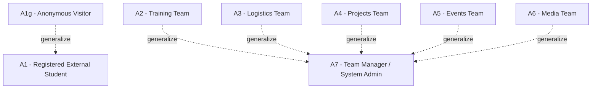

---

## 2. Functional Module Map (System Decomposition)

| ID | Module | Owning Actor(s) | Pillar |
|---|---|---|---|
| **M1** | Public Portal & Community Content | A6, A5, A4 | Pillar 1 |
| **M2** | Graduation Project Consultation Gateway | A1, A4 | Pillar 1 |
| **M3** | Course Catalogue, Application & Admissions | A1, A2 | Pillar 2 |
| **M4** | Screening, Assessment & Scoring | A1, A2, S4 | Pillar 2 |
| **M5** | Hardware Inventory & Checkout Logistics | A3, A4, A1 | Pillar 3 |
| **M6** | Clearance & Certification | A3, A2, A1, S3 | Pillar 3 |
| **M7** | Projects & Prototype Repository | A4, A6 | Pillar 1 |
| **M8** | Events, Workshops & Hackathons | A5, A1 | Pillar 1 |
| **M9** | Media, News & Hall of Fame | A6 | Pillar 1 |
| **M10** | Identity, RBAC, Audit & Analytics | A7 | Cross-cutting |

---

## 3. Governing Business Rules (Referenced by Acceptance Criteria)

These rules are stated here because Step 1 acceptance criteria depend on them. They are elaborated with full decision tables and activity diagrams in **Step 2**.

| ID | Rule | Enforcement Point |
|---|---|---|
| **BR-01** | **Logistical Clearance Lock.** A Certificate of Completion is neither generated, previewed, nor downloadable while any hardware assignment linked to the student (individually or through a team) is not in state `RETURNED` **and** inspection-resolved, **and** an approved `ClearanceRecord` does not exist for that enrollment. | M6 |
| **BR-02** | **Screening Gate.** No acceptance offer may be issued for a course that requires screening unless the applicant's normalized score ≥ the course pass threshold. | M4 → M3 |
| **BR-03** | **Ranked Capacity Allocation.** Seats are allocated in descending score order until capacity is reached; remaining qualified applicants enter the waiting list with a preserved rank. | M3 |
| **BR-04** | **Offer Expiry & Auto-Promotion.** An acceptance offer not confirmed within the configured window auto-expires; the highest-ranked waitlisted applicant is auto-promoted and notified. | M3 + S1 |
| **BR-05** | **Completion Threshold.** Enrollment reaches state `COMPLETED` only when attendance ≥ course minimum **and** all required evaluations are marked passed by A2. | M3 |
| **BR-06** | **Liability Resolution.** Any asset checked in as `Damaged` or `Lost` creates a `LiabilityRecord` that must be resolved (repaired / replaced / fee settled / waived by A7) before clearance can be approved. | M5 → M6 |
| **BR-07** | **Single Active Custody.** A serialized asset unit may have at most one active checkout record at any time. | M5 |
| **BR-08** | **Consultation Triage SLA.** Every consultation request must be triaged (assigned or rejected) within the configured SLA; breaches are escalated to A7. | M2 + S1 |
| **BR-09** | **Auditable RBAC.** Every permission-bearing action is authorized against a dynamic role–permission matrix and written to an immutable audit log with actor, timestamp, target and before/after state. | M10 |
| **BR-10** | **Verifiable Certificate.** Every issued certificate carries a unique, non-guessable verification code resolvable by any third party without authentication. | M6 |
| **BR-11** | **Publication Governance.** Public-facing content (news, projects, galleries, events) requires an explicit publish transition by an authorized actor; drafts are never publicly reachable. | M1, M7, M8, M9 |
| **BR-12** | **Requisition Before Custody.** Team-level hardware is issued only against an approved requisition; individual course kits are issued against an active enrollment. | M5 |

---

## 4. System Context Use Case Diagram (UCD-0)

High-level boundary showing each actor against its principal capability clusters.

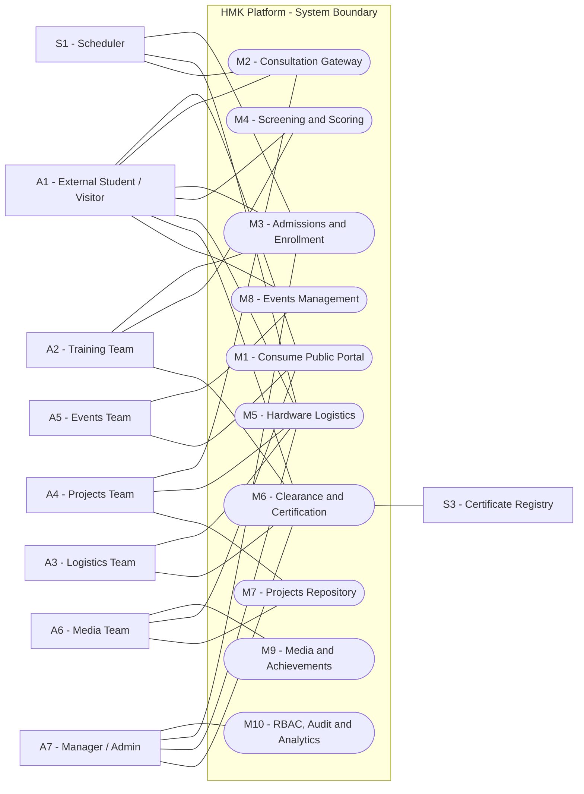

---

## 5. Actor A1 — External Student / Visitor

### 5.1 Use Case Diagram — Public Portal & Community (UCD-1)

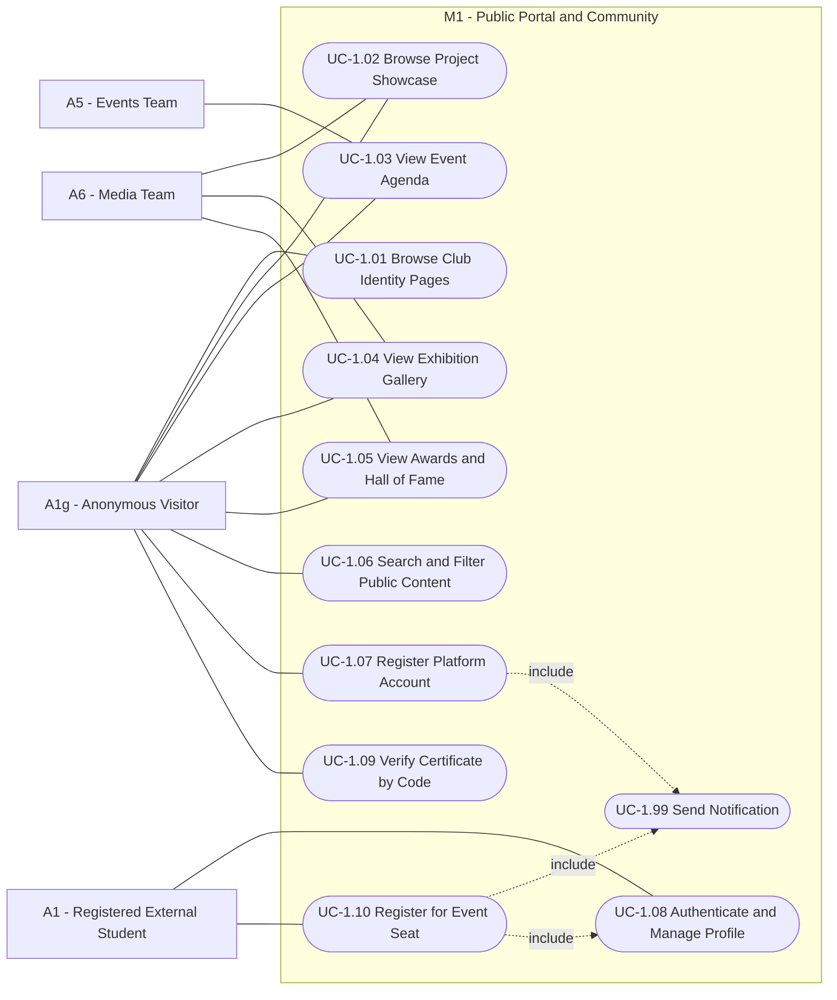

### 5.2 Use Case Diagram — Admissions, Screening, Custody & Certificate (UCD-2)

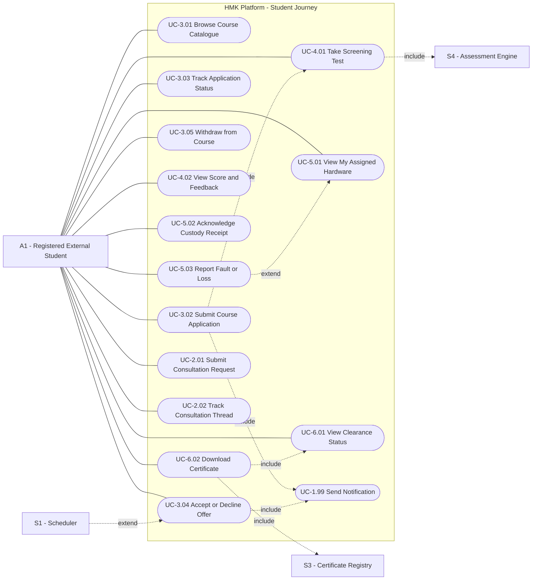

### 5.3 User Stories — A1

#### US-STU-01 — Browse the club identity and public portal `M`
> **As an** external visitor, **I want to** browse the club's identity, departments, and activity pages without creating an account, **so that** I can evaluate the club as a student, sponsor, or faculty member.

**Acceptance Criteria**
- **Given** I am unauthenticated, **when** I open any public page, **then** the content renders fully without a login prompt.
- **Given** a content item is in `DRAFT` state, **when** I browse or search publicly, **then** that item is never returned (BR-11).
- **Given** I open the portal in Arabic or English, **then** navigation, dates, and numerals render in the selected locale with RTL layout applied for Arabic.
- **Given** a page has been updated, **then** the public view reflects the latest **published** revision only.

#### US-STU-02 — Browse the project showcase `M`
> **As an** external visitor, **I want to** browse club projects and prototypes with their technical details and media, **so that** I can judge the club's technical depth.

**Acceptance Criteria**
- **Given** the showcase, **when** I filter by technology domain, year, or team, **then** only matching published projects are listed.
- **Given** a project detail page, **then** it displays title, abstract, technologies, gallery, contributing members, and outcome/awards where present.
- **Given** a project is linked to an award, **then** the award is displayed and hyperlinked to the Hall of Fame entry.
- **Given** no projects match a filter, **then** an explicit empty-state message is shown rather than a blank page.

#### US-STU-03 — View the dynamic event agenda `M`
> **As an** external visitor, **I want to** see upcoming and past workshops, exhibitions, and hackathons on a live agenda, **so that** I can plan attendance.

**Acceptance Criteria**
- **Given** the agenda, **then** events are grouped into `Upcoming` and `Archive` based on the event end datetime in the club time zone.
- **Given** an event detail, **then** date, time, venue, capacity, remaining seats, target audience, and registration state are shown.
- **Given** registration is closed or capacity is exhausted, **then** the registration control is disabled with the reason displayed.

#### US-STU-04 — View exhibition galleries and achievements `S`
> **As an** external visitor, **I want to** view exhibition galleries and the awards hall of fame, **so that** I can see the club's track record.

**Acceptance Criteria**
- **Given** a gallery, **then** media items load with captions and event/project attribution.
- **Given** an award entry, **then** it shows the awarding body, competition, level, date, and the associated project or member team.

#### US-STU-05 — Register a platform account `M`
> **As an** external student, **I want to** create an account with my academic identity, **so that** I can apply to courses and track my journey.

**Acceptance Criteria**
- **Given** the registration form, **then** full name, e-mail, mobile, university, faculty, department, academic year, and student ID are captured; university e-mail format is validated where applicable.
- **Given** an e-mail already registered, **when** I submit, **then** a non-enumerating error is shown and no duplicate account is created.
- **Given** successful submission, **then** the account is created in state `PENDING_VERIFICATION` and a verification notification is dispatched (`<<include>> UC-1.99`).
- **Given** I have not verified my e-mail, **when** I attempt to apply to a course, **then** the action is blocked with a resend-verification option.

#### US-STU-06 — Authenticate and manage my profile `M`
> **As a** registered external student, **I want to** log in, reset my password, and maintain my profile and skills, **so that** my applications and consultation requests carry accurate data.

**Acceptance Criteria**
- **Given** valid credentials, **then** I reach a personal dashboard showing applications, enrollments, hardware custody, clearance and certificates.
- **Given** repeated failed attempts, **then** progressive rate limiting is applied and the event is audited (BR-09).
- **Given** I update profile fields, **then** changes are versioned and do not retroactively alter data already frozen into a submitted application.

#### US-STU-07 — Browse the course catalogue `M`
> **As an** external student, **I want to** browse specialized courses with prerequisites, schedule, capacity and screening requirements, **so that** I can choose what fits me.

**Acceptance Criteria**
- **Given** the catalogue, **then** each course shows title, track, level, syllabus outline, instructor/department, seats, start date, application window, and whether a screening test is required.
- **Given** an application window is closed, **then** the apply control is disabled with the window dates shown.
- **Given** a course has prerequisites I do not satisfy, **then** the prerequisite gap is displayed before I apply.

#### US-STU-08 — Submit a course application `M`
> **As an** external student, **I want to** apply to a course and provide the required background information, **so that** I can be considered for a seat.

**Acceptance Criteria**
- **Given** an open course and a verified account, **when** I submit an application, **then** an `Application` record is created in state `SUBMITTED` with an immutable snapshot of my declared background.
- **Given** I already have an active application to the same course cohort, **then** a second submission is rejected.
- **Given** the course requires screening, **then** the application immediately transitions to `AWAITING_SCREENING` and the test invitation is dispatched.
- **Given** submission succeeds, **then** a confirmation notification is sent and the application appears in my dashboard within the same session.

#### US-STU-09 — Take the automated screening test `M`
> **As an** external student, **I want to** take a timed screening test online, **so that** my readiness for the course can be assessed objectively.

**Acceptance Criteria**
- **Given** an active invitation within its validity window, **when** I start the test, **then** the attempt is timestamped and the countdown is server-authoritative.
- **Given** the timer expires or I lose connectivity, **then** answers already submitted are preserved and the attempt is auto-submitted at the deadline.
- **Given** the course allows N attempts, **when** I have consumed N, **then** further starts are blocked with the retake policy displayed.
- **Given** I submit, **then** auto-gradable questions are scored by S4 immediately and manually-graded items are queued for A2 (`US-TRN-05`).
- **Given** the test is in progress, **then** questions/options are presented in the randomized order defined by the course policy.

#### US-STU-10 — View my score and feedback `S`
> **As an** external student, **I want to** see my screening result and feedback once released, **so that** I understand my standing.

**Acceptance Criteria**
- **Given** results are not yet released by A2, **then** my status shows `Under Evaluation` and no score is exposed.
- **Given** results are released, **then** I see my normalized score, the pass threshold, pass/fail verdict, and per-section feedback if configured.
- **Given** the course policy hides correct answers, **then** answer keys are never exposed through any view or export.

#### US-STU-11 — Track application status and offer `M`
> **As an** external student, **I want to** track my application through every state, **so that** I always know what happens next.

**Acceptance Criteria**
- **Given** my dashboard, **then** the application state is one of `SUBMITTED`, `AWAITING_SCREENING`, `UNDER_EVALUATION`, `OFFERED`, `WAITLISTED`, `ENROLLED`, `REJECTED`, `WITHDRAWN`, `EXPIRED`.
- **Given** I am waitlisted, **then** my waitlist rank is displayed (BR-03).
- **Given** any state transition occurs, **then** a notification is dispatched and a timestamped history entry is appended.

#### US-STU-12 — Accept or decline an acceptance offer `M`
> **As an** accepted student, **I want to** confirm or decline my seat before the deadline, **so that** my place is secured or released fairly.

**Acceptance Criteria**
- **Given** an offer in state `OFFERED`, **then** the confirmation deadline is displayed with a live countdown.
- **Given** I confirm before the deadline, **then** the enrollment is created in state `ENROLLED` and the seat count decrements atomically.
- **Given** I decline, or the deadline passes without action, **then** the offer becomes `DECLINED`/`EXPIRED` and BR-04 auto-promotion is triggered by S1.
- **Given** capacity was consumed concurrently, **then** my confirmation is rejected with an explicit message and I am returned to the waitlist at my preserved rank.

#### US-STU-13 — View my assigned hardware and acknowledge custody `M`
> **As an** enrolled student, **I want to** see every hardware item assigned to me and acknowledge receipt, **so that** custody and due dates are unambiguous.

**Acceptance Criteria**
- **Given** my dashboard, **then** each assignment shows asset name, serial/tag, quantity, condition at issue, issuing officer, checkout date and due date.
- **Given** an item is issued to me, **then** I must acknowledge receipt; unacknowledged items are flagged to A3 after the configured interval.
- **Given** an item is past due, **then** it is visually flagged as `OVERDUE` and the certificate section shows the blocking reason (BR-01).

#### US-STU-14 — Report a hardware fault or loss `S`
> **As an** enrolled student, **I want to** report that an assigned item is faulty, damaged, or lost, **so that** logistics can act early and my liability is recorded transparently.

**Acceptance Criteria**
- **Given** an active assignment, **when** I submit a report with a description and optional photos, **then** an incident is created and A3 is notified.
- **Given** an incident exists, **then** its resolution state is visible to me until closure.
- **Given** the incident is closed as `Damaged` or `Lost`, **then** a `LiabilityRecord` is visible with its resolution requirement (BR-06).

#### US-STU-15 — View clearance status and download my certificate `M`
> **As a** student who completed a course, **I want to** see exactly what blocks my clearance and download my certificate once cleared, **so that** I am never left guessing.

**Acceptance Criteria**
- **Given** any outstanding item or unresolved liability, **then** the certificate is **not** generated, not previewable, and not downloadable, and the UI lists each blocking item explicitly (BR-01).
- **Given** all items are returned, inspected, liabilities resolved, and A3 has approved clearance, **and** BR-05 completion is satisfied, **then** the certificate becomes available and a notification is dispatched.
- **Given** the certificate is issued, **then** it carries a unique verification code and issue date (BR-10).
- **Given** a clearance is later revoked by A7, **then** the certificate is marked `REVOKED`, download is disabled, and public verification reports the revoked state.

#### US-STU-16 — Verify a certificate publicly `S`
> **As an** employer or faculty member, **I want to** verify a certificate by its code without an account, **so that** I can trust the credential.

**Acceptance Criteria**
- **Given** a valid code, **then** holder name, course, issue date and status are shown — with no other personal data.
- **Given** an invalid, revoked, or unknown code, **then** an explicit negative result is returned.
- **Given** repeated lookups from one source, **then** rate limiting prevents enumeration.

#### US-STU-17 — Submit a graduation project consultation request `M`
> **As a** university student outside the club, **I want to** request a technical consultation for my graduation project, **so that** I can be matched with a specialized HMK member.

**Acceptance Criteria**
- **Given** the consultation form, **then** project title, abstract, domain/technology tags, university, supervisor, deadline, and requested support type are captured.
- **Given** submission, **then** a request is created in state `NEW`, a reference number is issued, and A4 is notified.
- **Given** the SLA window elapses without triage, **then** the request is escalated to A7 (BR-08).
- **Given** I have an unresolved request in the same domain, **then** the system warns me before creating a duplicate.

#### US-STU-18 — Track and interact with my consultation thread `S`
> **As a** requesting student, **I want to** follow my request and exchange messages with the assigned expert, **so that** the consultation actually progresses.

**Acceptance Criteria**
- **Given** my request, **then** its state is one of `NEW`, `TRIAGED`, `ASSIGNED`, `IN_PROGRESS`, `RESOLVED`, `REJECTED`, with reason text on rejection.
- **Given** an expert is assigned, **then** I can exchange messages and attachments within the thread only.
- **Given** the request is resolved, **then** I am prompted to submit a satisfaction rating.

#### US-STU-19 — Register for an event seat `S`
> **As a** visitor or student, **I want to** register for a workshop, exhibition, or hackathon, **so that** my seat is reserved.

**Acceptance Criteria**
- **Given** open registration with remaining capacity, **when** I register, **then** a registration record with a unique attendance token is created and confirmed by notification.
- **Given** capacity is exhausted, **then** I may join the event waiting list and am auto-promoted on cancellation.
- **Given** I registered, **then** I can cancel before the cutoff, releasing my seat immediately.

---

## 6. Actor A2 — Training Team

### 6.1 Use Case Diagram — Course Authoring & Admissions (UCD-3)

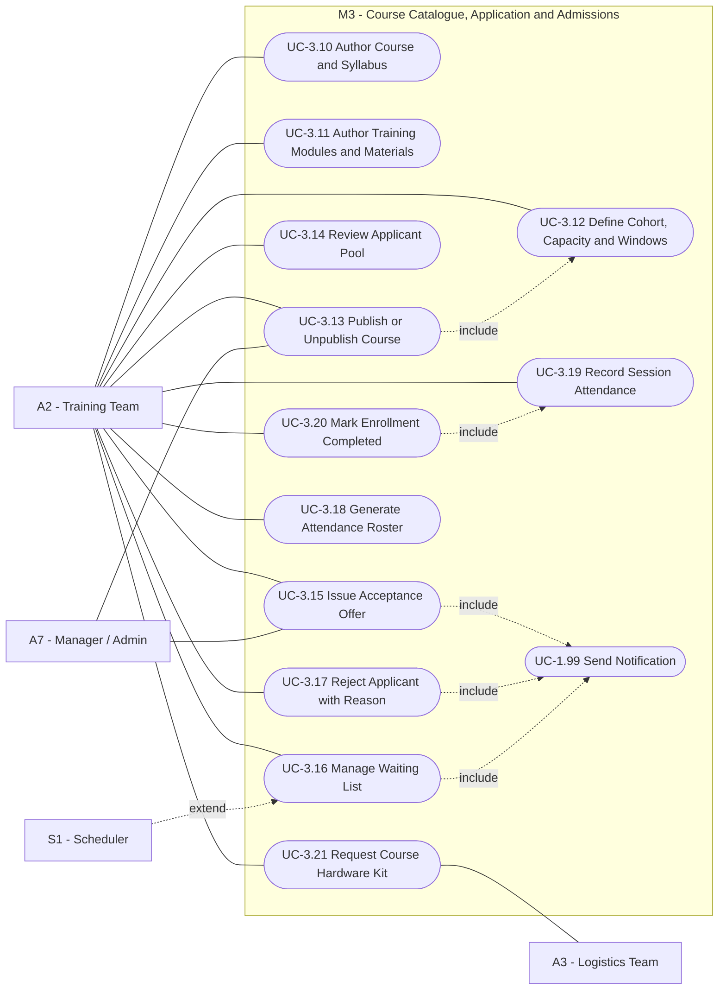

### 6.2 Use Case Diagram — Screening, Assessment & Scoring (UCD-4)

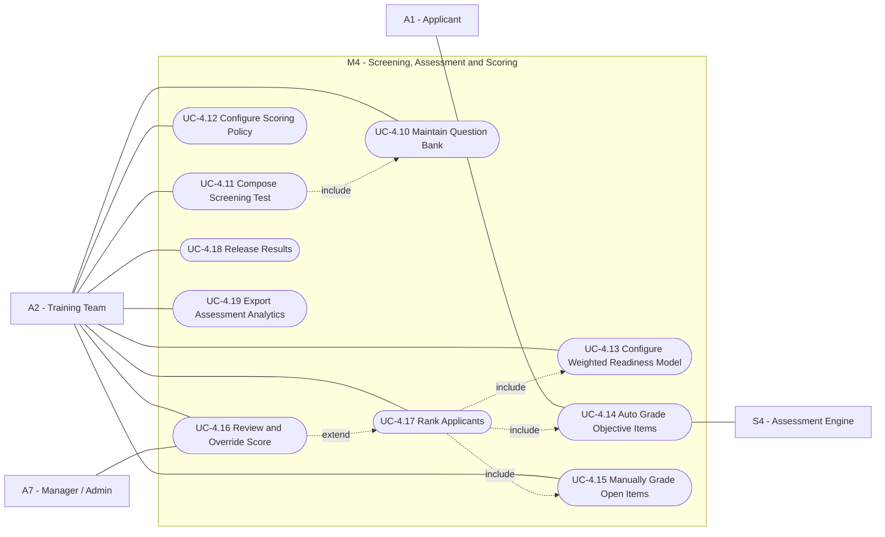

### 6.3 User Stories — A2

#### US-TRN-01 — Author a course and its syllabus `M`
> **As a** Training Team member, **I want to** create a course with a structured syllabus, prerequisites, level and learning outcomes, **so that** applicants understand exactly what they are joining.

**Acceptance Criteria**
- **Given** the authoring form, **then** title, track, level, description, outcomes, prerequisites, session count, duration, language and required hardware kit are captured.
- **Given** a course is saved, **then** it is created in `DRAFT` and is not publicly reachable (BR-11).
- **Given** I lack the `course.author` permission, **then** the action is denied and audited (BR-09).
- **Given** a course is edited after publication, **then** a new revision is stored and the change is attributed to me with a timestamp.

#### US-TRN-02 — Author training modules and materials `M`
> **As a** Training Team member, **I want to** structure a course into ordered modules with attached materials, **so that** delivery is consistent across instructors and cohorts.

**Acceptance Criteria**
- **Given** a course, **when** I add modules, **then** each module has an order index, title, objectives, estimated duration and optional attachments.
- **Given** I reorder modules, **then** the new order persists and is reflected for enrolled students.
- **Given** a module is marked `internal`, **then** it is visible to A2/A7 only and never to students.

#### US-TRN-03 — Define a cohort with capacity and application windows `M`
> **As a** Training Team member, **I want to** open a cohort with seat capacity, application window and start date, **so that** admissions are bounded and predictable.

**Acceptance Criteria**
- **Given** a cohort, **then** capacity, waitlist capacity, application open/close datetimes, offer confirmation window (BR-04) and minimum attendance percentage (BR-05) are configured.
- **Given** the close datetime passes, **then** new applications are rejected automatically by S1.
- **Given** capacity is reduced below current enrollments, **then** the change is blocked with an explanatory error.

#### US-TRN-04 — Formulate and maintain the screening question bank `M`
> **As a** Training Team member, **I want to** maintain a reusable, tagged question bank, **so that** screening tests can be assembled quickly and fairly.

**Acceptance Criteria**
- **Given** a new question, **then** type (single-choice, multi-choice, true/false, numeric, short answer, code), stem, options, correct key, score weight, difficulty and topic tags are captured.
- **Given** a question is used in a delivered test, **when** I edit it, **then** a new version is created and historical attempts remain bound to the original version.
- **Given** I have no `quiz.author` permission, **then** access is denied and audited.

#### US-TRN-05 — Compose a screening test and its scoring policy `M`
> **As a** Training Team member, **I want to** compose a test from the bank with time limits, randomization and a pass threshold, **so that** applicant readiness is measured consistently.

**Acceptance Criteria**
- **Given** a test, **then** duration, attempt limit, question selection (fixed or randomized per topic quota), shuffle policy, pass threshold and result-visibility policy are configured.
- **Given** the test is bound to a cohort, **then** its total weight is validated to equal the declared maximum score.
- **Given** the test has been attempted by at least one applicant, **then** structural edits are blocked; only a new version may be created.

#### US-TRN-06 — Configure the weighted readiness model `S`
> **As a** Training Team member, **I want to** combine test score with declared background factors into one normalized readiness score, **so that** ranking reflects more than raw quiz marks.

**Acceptance Criteria**
- **Given** the model editor, **then** each factor has a weight and the weights are validated to sum to 100%.
- **Given** a model change, **then** it applies only to cohorts that have not yet issued offers.
- **Given** a computed score, **then** the factor-by-factor breakdown is retrievable for audit and appeal.

#### US-TRN-07 — Review automated results and grade open items `M`
> **As a** Training Team member, **I want to** review auto-graded results and manually grade open-ended answers, **so that** the final score is defensible.

**Acceptance Criteria**
- **Given** a submitted attempt, **then** objective items are already scored by S4 and open items are queued with anonymized identity if blind grading is enabled.
- **Given** I grade an open item, **then** the awarded marks cannot exceed the item weight and a comment may be attached.
- **Given** all items are graded, **then** the attempt state becomes `GRADED` and the readiness score is computed.
- **Given** I override an auto score, **then** the original value, new value, reason and my identity are recorded immutably (BR-09).

#### US-TRN-08 — Rank applicants and release results `M`
> **As a** Training Team member, **I want to** rank the applicant pool by readiness score and release results, **so that** allocation follows an objective order.

**Acceptance Criteria**
- **Given** a graded pool, **then** applicants are ranked descending by normalized score with a deterministic, documented tie-breaker.
- **Given** applicants below the pass threshold, **then** they are excluded from offers (BR-02) and marked `REJECTED` with the configured reason.
- **Given** I release results, **then** all affected applicants are notified in one atomic operation and no partial release state is observable.

#### US-TRN-09 — Issue acceptance offers and manage the waiting list `M`
> **As a** Training Team member, **I want to** issue offers up to capacity and maintain a ranked waiting list, **so that** seats are filled fairly and never left idle.

**Acceptance Criteria**
- **Given** capacity C, **when** I issue offers, **then** exactly the top C qualified applicants receive `OFFERED` and the remainder receive `WAITLISTED` with rank (BR-03).
- **Given** an offer expires or is declined, **then** S1 auto-promotes the highest-ranked waitlisted applicant and notifies them (BR-04).
- **Given** I manually promote a waitlisted applicant out of order, **then** a justification is mandatory and the action is audited.
- **Given** a seat is confirmed, **then** the enrollment record is created and linked to the cohort.

#### US-TRN-10 — Request the course hardware kit from Logistics `M`
> **As a** Training Team member, **I want to** raise a requisition for the kits a cohort needs, **so that** Logistics can prepare and issue them before day one.

**Acceptance Criteria**
- **Given** a cohort with a defined kit template, **when** I submit the requisition, **then** it is created in `PENDING` and routed to A3 with the required-by date.
- **Given** A3 approves or rejects, **then** I am notified with the reason and, on approval, with the reserved quantities.
- **Given** requested quantity exceeds available stock, **then** the shortfall is surfaced at submission time, not at fulfilment time.

#### US-TRN-11 — Generate attendance rosters and record attendance `M`
> **As a** Training Team member, **I want to** generate per-session rosters and record attendance, **so that** completion eligibility can be computed objectively.

**Acceptance Criteria**
- **Given** a cohort session, **then** the roster lists all `ENROLLED` students with a per-session attendance state (`Present`, `Absent`, `Excused`, `Late`).
- **Given** attendance is recorded, **then** the cumulative attendance percentage per student is recomputed immediately.
- **Given** a roster is exported, **then** the export reflects the state at export time and is watermarked with generator and timestamp.
- **Given** attendance is edited after the session closes, **then** the edit is audited with reason.

#### US-TRN-12 — Mark an enrollment as completed `M`
> **As a** Training Team member, **I want to** mark completion once attendance and evaluations are satisfied, **so that** the certification pipeline can begin.

**Acceptance Criteria**
- **Given** attendance < the cohort minimum, **when** I attempt to mark completion, **then** the action is blocked with the deficit shown (BR-05); only A7 may override, with justification.
- **Given** completion is marked, **then** the enrollment becomes `COMPLETED` and a certification request is queued — **but no certificate is generated** while clearance is unmet (BR-01).
- **Given** completion is marked, **then** A3 is notified that this student's assets are now due for return.

#### US-TRN-13 — View training analytics `S`
> **As a** Training Team member, **I want to** see funnel, score-distribution and attendance analytics per cohort, **so that** I can improve future courses.

**Acceptance Criteria**
- **Given** a cohort, **then** the funnel shows applied → screened → passed → offered → confirmed → completed with conversion percentages.
- **Given** item-level statistics, **then** difficulty index and discrimination per question are shown for tests with sufficient attempts.
- **Given** an export, **then** personal data is included only if I hold the `analytics.pii` permission; otherwise it is aggregated.

---

## 7. Actor A3 — Logistics Team *(Core Operational Engine)*

### 7.1 Use Case Diagram — Hardware Inventory & Custody (UCD-5)

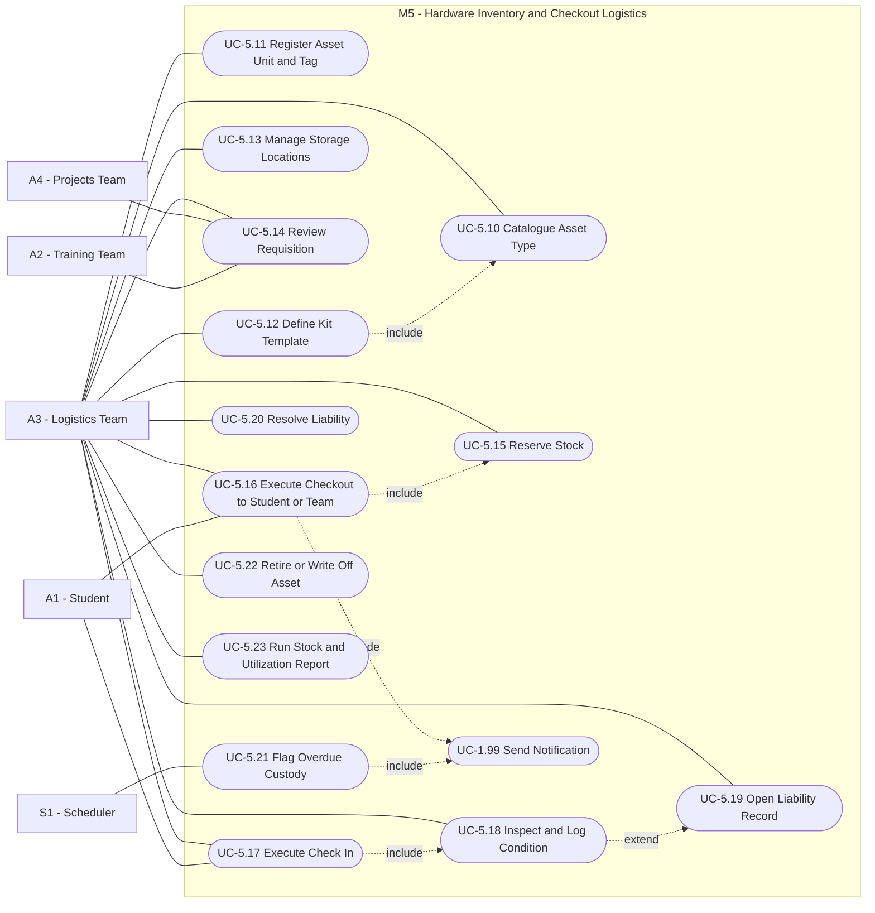

### 7.2 Use Case Diagram — Clearance & Certification Lock (UCD-6)

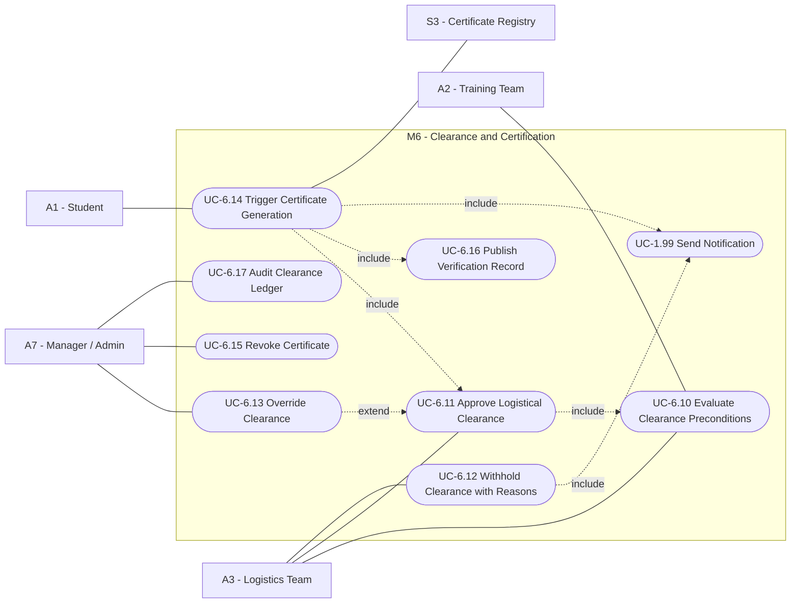

> **Design assertion for BR-01.** `UC-6.14 Trigger Certificate Generation` has a mandatory `<<include>>` on `UC-6.11 Approve Logistical Clearance`, which itself `<<include>>`s `UC-6.10 Evaluate Clearance Preconditions`. There is **no path** from an enrollment to a certificate that bypasses this chain. The only alternate path is `UC-6.13 Override Clearance`, reachable exclusively by A7 and unconditionally audited.

### 7.3 User Stories — A3

#### US-LOG-01 — Catalogue asset types `M`
> **As a** Logistics Team member, **I want to** define asset types with specifications and categories, **so that** the inventory is searchable and standardized.

**Acceptance Criteria**
- **Given** a new asset type, **then** name, category (microcontroller, sensor, actuator, tool, 3D-printing equipment, consumable, other), manufacturer, model, specifications, datasheet link, unit of measure and tracking mode (`serialized` or `bulk`) are captured.
- **Given** a duplicate manufacturer+model, **then** the system warns before creating a second type.
- **Given** a `consumable` type, **then** it is excluded from return obligations but included in quantity accounting.

#### US-LOG-02 — Register individual asset units with unique tags `M`
> **As a** Logistics Team member, **I want to** register each physical unit with a unique asset tag, **so that** custody is traceable at the unit level.

**Acceptance Criteria**
- **Given** a serialized type, **then** each unit receives a unique asset tag, acquisition date, source, cost centre, storage location and initial condition.
- **Given** a duplicate asset tag, **then** creation is rejected.
- **Given** a bulk-tracked type, **then** a quantity-on-hand counter per location is maintained instead of unit records.
- **Given** any unit, **then** its full custody history is retrievable chronologically.

#### US-LOG-03 — Define kit templates `S`
> **As a** Logistics Team member, **I want to** define reusable kits (e.g. "Arduino Starter Kit"), **so that** course checkouts are one action instead of twenty.

**Acceptance Criteria**
- **Given** a kit template, **then** it lists component asset types with required quantities.
- **Given** a kit is issued, **then** each component generates its own checkout line so that partial returns are representable.
- **Given** a kit component is out of stock, **then** the kit cannot be issued complete and the shortfall is displayed.

#### US-LOG-04 — Review and approve requisitions `M`
> **As a** Logistics Team member, **I want to** review requisitions from Training and Projects teams, **so that** issuance is planned against real availability.

**Acceptance Criteria**
- **Given** a `PENDING` requisition, **then** requester, purpose (cohort or project), lines, quantities and required-by date are shown alongside live availability.
- **Given** I approve, **then** stock is reserved (BR-12) and the requester is notified; reserved stock is not issuable to anyone else.
- **Given** I reject, **then** a reason is mandatory and the requester is notified.
- **Given** a reservation is not consumed by its expiry date, **then** S1 releases it and notifies both parties.

#### US-LOG-05 — Execute checkout to a student or project team `M`
> **As a** Logistics Team member, **I want to** check out assets to a specific student or team with a due date, **so that** responsibility is explicitly recorded.

**Acceptance Criteria**
- **Given** a serialized unit already in an active checkout, **when** I attempt to issue it, **then** the action is blocked (BR-07) and the current holder is shown.
- **Given** an issuance to a student, **then** it must reference an active enrollment; to a team, it must reference an approved requisition (BR-12).
- **Given** checkout is confirmed, **then** condition-at-issue, issuing officer, timestamp and due date are recorded and the holder is notified for acknowledgement.
- **Given** the holder has an unresolved liability, **then** further checkouts are blocked unless A7 overrides with justification.

#### US-LOG-06 — Execute check-in with mandatory inspection `M`
> **As a** Logistics Team member, **I want to** receive returned assets and log their verified condition, **so that** clearance decisions rest on inspected facts, not assumptions.

**Acceptance Criteria**
- **Given** an active checkout, **when** I check the item in, **then** I must record a condition of `Healthy`, `Damaged`, or `Lost` — check-in cannot be saved without it.
- **Given** condition `Healthy`, **then** the unit returns to available stock at the selected location.
- **Given** condition `Damaged`, **then** the unit moves to `UNDER_REPAIR` and a `LiabilityRecord` is opened (BR-06).
- **Given** condition `Lost`, **then** the unit moves to `LOST`, is removed from available stock, and a `LiabilityRecord` is opened.
- **Given** partial return of a kit, **then** only returned lines close while the remainder stays outstanding and continues to block clearance.
- **Given** any check-in, **then** receiving officer, timestamp, condition, notes and optional evidence photos are recorded immutably.

#### US-LOG-07 — Track and escalate overdue custody `S`
> **As a** Logistics Team member, **I want to** see and escalate overdue items automatically, **so that** assets circulate instead of disappearing.

**Acceptance Criteria**
- **Given** a due date passes without check-in, **then** S1 flags the checkout `OVERDUE` and notifies holder and A3.
- **Given** configured escalation intervals, **then** reminders repeat and A7 is notified at the final threshold.
- **Given** the overdue dashboard, **then** items are sortable by days overdue, holder, cohort/project and asset value.

#### US-LOG-08 — Resolve liabilities `M`
> **As a** Logistics Team member, **I want to** resolve damage/loss liabilities through repair, replacement, fee settlement, or waiver, **so that** clearance is unblocked on a documented basis.

**Acceptance Criteria**
- **Given** an open liability, **then** resolution options are `Repaired`, `Replaced`, `Fee Settled`, `Waived` — with `Waived` restricted to A7.
- **Given** a resolution, **then** justification and supporting evidence are mandatory and recorded.
- **Given** the last open liability for an enrollment is resolved, **then** the clearance precondition evaluation is re-run automatically (`UC-6.10`).

#### US-LOG-09 — Evaluate clearance preconditions `M`
> **As a** Logistics Team member, **I want** the system to compute, per enrollment, exactly what blocks clearance, **so that** approval is a verification act rather than a memory exercise.

**Acceptance Criteria**
- **Given** an enrollment, **then** the checklist shows: all checkouts returned, all inspections completed, all liabilities resolved, completion state satisfied — each with pass/fail and drill-down.
- **Given** any item fails, **then** the `Approve Clearance` control is disabled and the failing reasons are enumerated.
- **Given** all items pass, **then** the control is enabled and the evaluation snapshot is stored for audit.

#### US-LOG-10 — Issue logistical clearance (براءة ذمة) `M`
> **As a** Logistics Team member, **I want to** grant explicit clearance for a student, **so that** their certificate can be released and the club's assets are provably intact.

**Acceptance Criteria**
- **Given** all preconditions pass, **when** I approve, **then** a `ClearanceRecord` is created with approver identity, timestamp and the precondition snapshot.
- **Given** clearance is approved, **then** certificate generation is triggered (`UC-6.14`) and both student and A2 are notified.
- **Given** preconditions do not pass, **then** approval is rejected server-side even if the client control is manipulated (BR-01 is enforced at the domain layer, not the UI).
- **Given** clearance was granted in error, **then** only A7 may revoke it, which simultaneously revokes the certificate (`UC-6.15`).

#### US-LOG-11 — Withhold clearance with documented reasons `M`
> **As a** Logistics Team member, **I want to** formally withhold clearance and state why, **so that** the student sees an actionable list rather than silence.

**Acceptance Criteria**
- **Given** a withhold action, **then** at least one structured reason is required and is surfaced verbatim in the student's dashboard.
- **Given** a withheld clearance, **then** the student is notified with the exact outstanding items and their expected remedies.
- **Given** the blocking condition later clears, **then** the withhold is superseded automatically and the record retained for audit.

#### US-LOG-12 — Retire or write off assets `C`
> **As a** Logistics Team member, **I want to** retire obsolete assets and write off lost ones, **so that** stock figures reflect reality.

**Acceptance Criteria**
- **Given** a retirement, **then** reason, date and approving authority are recorded and the unit leaves available stock without deletion.
- **Given** a unit with an active checkout, **then** retirement is blocked until check-in or write-off with A7 approval.

#### US-LOG-13 — Run stock, custody and utilization reports `S`
> **As a** Logistics Team member, **I want to** report on stock levels, utilization and loss rates, **so that** procurement decisions are evidence-based.

**Acceptance Criteria**
- **Given** the stock report, **then** on-hand, reserved, checked-out, under-repair and lost quantities are shown per asset type and location.
- **Given** the utilization report, **then** checkout frequency and mean custody duration per asset type over a selectable period are shown.
- **Given** a low-stock threshold is breached, **then** A3 is notified proactively.

---

## 8. Actor A4 — Projects Team

### 8.1 Use Case Diagram — Projects & Consultation Gateway (UCD-7)

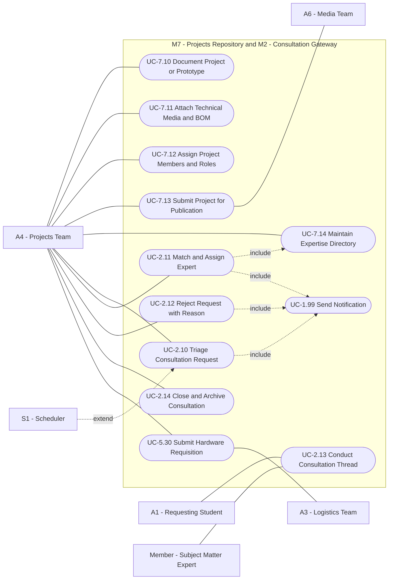

### 8.2 User Stories — A4

#### US-PRJ-01 — Document technical projects and prototypes `M`
> **As a** Projects Team member, **I want to** document each club project with full technical detail, **so that** the club's work is preserved and showcased credibly.

**Acceptance Criteria**
- **Given** a project record, **then** title, abstract, problem statement, technologies, status (`Idea`, `In Progress`, `Completed`, `Archived`), start/end dates and outcomes are captured.
- **Given** a project is saved, **then** it starts in `DRAFT` and is not publicly visible (BR-11).
- **Given** a project references hardware, **then** the bill of materials links to catalogued asset types from M5 rather than free text.

#### US-PRJ-02 — Attach media and technical artefacts `S`
> **As a** Projects Team member, **I want to** attach images, videos, schematics and documents to a project, **so that** the showcase is visually and technically convincing.

**Acceptance Criteria**
- **Given** an upload, **then** file type and size are validated against policy and a caption is required for gallery items.
- **Given** a cover image is set, **then** it is used in all listing and card views.
- **Given** an artefact is marked `internal`, **then** it is excluded from every public rendering.

#### US-PRJ-03 — Assign project members and roles `S`
> **As a** Projects Team member, **I want to** attribute contributions to specific members with roles, **so that** credit is accurate and expertise is discoverable.

**Acceptance Criteria**
- **Given** a project, **then** members are added from the member directory with a role (lead, hardware, firmware, mechanical, ML, documentation).
- **Given** a member is attributed, **then** the project appears in that member's portfolio.
- **Given** a member is removed, **then** historical attribution remains in the audit log.

#### US-PRJ-04 — Submit a project for publication `S`
> **As a** Projects Team member, **I want to** submit a completed project record for publication, **so that** it appears in the public showcase after review.

**Acceptance Criteria**
- **Given** a submission, **then** required fields are validated and the record moves to `PENDING_REVIEW`, notifying A6/A7.
- **Given** approval, **then** the project becomes `PUBLISHED` with a publication timestamp and publisher identity.
- **Given** rejection, **then** reviewer comments return with the record to `DRAFT`.

#### US-PRJ-05 — Maintain the expertise directory `M`
> **As a** Projects Team member, **I want to** maintain a directory of members' specializations and availability, **so that** consultation matching is systematic rather than ad hoc.

**Acceptance Criteria**
- **Given** a member entry, **then** domain tags, proficiency level, past project evidence, current consultation load and availability flag are recorded.
- **Given** a member is unavailable or at maximum load, **then** they are excluded from match suggestions.

#### US-PRJ-06 — Triage incoming graduation consultation requests `M`
> **As a** Projects Team member, **I want to** triage each request within the SLA, **so that** external students receive a timely, qualified response.

**Acceptance Criteria**
- **Given** a `NEW` request, **then** the triage queue shows it with age, domain tags and SLA remaining time.
- **Given** triage, **then** I set domain classification, complexity and priority, moving the request to `TRIAGED`.
- **Given** the SLA elapses without triage, **then** S1 escalates to A7 and flags the queue item (BR-08).

#### US-PRJ-07 — Match and assign a subject-matter expert `M`
> **As a** Projects Team member, **I want** the system to suggest matching experts by domain, load and availability, **so that** requests reach the right person.

**Acceptance Criteria**
- **Given** a triaged request, **then** ranked candidate experts are suggested with the matching rationale (domain overlap, evidence, current load).
- **Given** I assign an expert, **then** the request becomes `ASSIGNED`, the expert and the student are notified, and the expert's load counter increments.
- **Given** an expert declines within the response window, **then** the request returns to the triage queue with the decline reason retained.
- **Given** no expert matches, **then** I may reject with reason (`UC-2.12`) or escalate to A7.

#### US-PRJ-08 — Conduct and close consultation threads `S`
> **As a** Projects Team member or assigned expert, **I want to** exchange messages and artefacts with the requester and close the case, **so that** the engagement is documented end to end.

**Acceptance Criteria**
- **Given** an assigned request, **then** thread participants are limited to the requester, the assigned expert and A4/A7.
- **Given** closure, **then** an outcome summary and category (`Advice Given`, `Ongoing Mentorship`, `Out of Scope`, `Unresponsive`) are mandatory.
- **Given** closure, **then** the requester is invited to rate the consultation and the rating is aggregated into expert statistics.

#### US-PRJ-09 — Submit hardware requisitions for project teams `M`
> **As a** Projects Team member, **I want to** requisition hardware for a project team from Logistics, **so that** builds are supplied through a traceable channel.

**Acceptance Criteria**
- **Given** a requisition, **then** it references a project, lists asset types and quantities, states purpose and required-by date, and enters `PENDING` for A3 (BR-12).
- **Given** approval, **then** reserved quantities and the pickup window are shown to me.
- **Given** issued items, **then** custody is attributed to the named team representative and appears in that member's custody list.

---

## 9. Actor A5 — Events Team

### 9.1 Use Case Diagram — Events, Workshops & Hackathons (UCD-8)

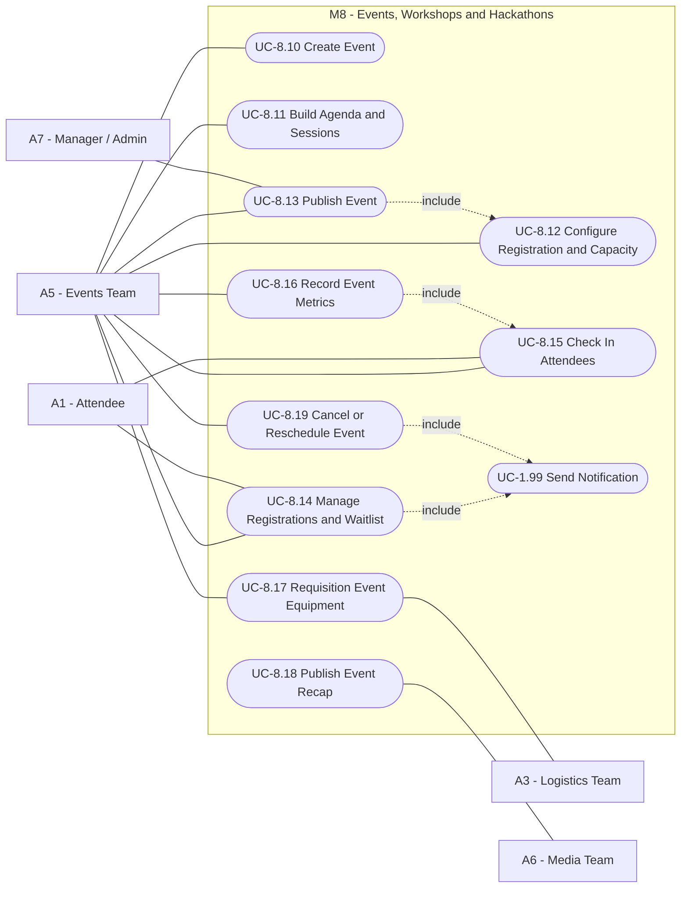

### 9.2 User Stories — A5

#### US-EVT-01 — Create and schedule an event `M`
> **As an** Events Team member, **I want to** create workshops, exhibitions and hackathons with full scheduling data, **so that** the public agenda is accurate.

**Acceptance Criteria**
- **Given** an event, **then** type, title, description, start/end datetime, venue, target audience, organizing department and capacity are captured.
- **Given** an overlapping venue booking, **then** a conflict warning is raised before saving.
- **Given** creation, **then** the event starts in `DRAFT` and is invisible publicly (BR-11).

#### US-EVT-02 — Build a multi-session agenda `S`
> **As an** Events Team member, **I want to** structure an event into timed sessions with speakers, **so that** attendees know the exact programme.

**Acceptance Criteria**
- **Given** sessions, **then** each has a time slot, title, speaker/facilitator, track and room; overlapping slots in the same room are rejected.
- **Given** the agenda is published, **then** it renders chronologically on the public page.

#### US-EVT-03 — Configure registration rules and capacity `M`
> **As an** Events Team member, **I want to** configure registration windows, capacity, waitlist and eligibility, **so that** attendance is managed fairly.

**Acceptance Criteria**
- **Given** configuration, **then** open/close datetimes, capacity, waitlist capacity, cancellation cutoff and eligibility (public / registered students / members only) are set.
- **Given** capacity is reached, **then** further registrations go to the waitlist and auto-promote on cancellations.
- **Given** eligibility is `members only`, **then** ineligible users cannot register even with a direct link.

#### US-EVT-04 — Manage registrations and the waitlist `M`
> **As an** Events Team member, **I want to** view, filter, and manually adjust registrations, **so that** exceptional cases are handled without breaking the record.

**Acceptance Criteria**
- **Given** the registration list, **then** it is filterable by state (`Registered`, `Waitlisted`, `Cancelled`, `Attended`, `No-show`) and exportable.
- **Given** a manual promotion or cancellation, **then** a reason is recorded and the affected person is notified.

#### US-EVT-05 — Check in attendees on the day `M`
> **As an** Events Team member, **I want to** check in attendees against their registration token, **so that** attendance metrics are real.

**Acceptance Criteria**
- **Given** a valid token, **then** the registration becomes `Attended` with a timestamp; a second scan is rejected as duplicate.
- **Given** a walk-in, **then** an on-site registration can be created if capacity allows and is marked as `walk-in`.
- **Given** event end, **then** all `Registered` records without check-in become `No-show`.

#### US-EVT-06 — Requisition event equipment `S`
> **As an** Events Team member, **I want to** requisition hardware and equipment for an event, **so that** the venue is properly equipped and items return afterwards.

**Acceptance Criteria**
- **Given** a requisition referencing an event, **then** it follows the same approval and custody rules as M5 (BR-12).
- **Given** issued equipment, **then** custody is attributed to the named event lead with a due date after the event end.
- **Given** items are outstanding after the due date, **then** overdue escalation applies (US-LOG-07).

#### US-EVT-07 — Report event metrics and publish a recap `S`
> **As an** Events Team member, **I want to** see registration-to-attendance metrics and hand a recap to Media, **so that** the club can prove impact to sponsors and leadership.

**Acceptance Criteria**
- **Given** a completed event, **then** registered, attended, no-show, walk-in counts and attendance rate are computed.
- **Given** a series of events, **then** trends over a selectable period are shown by event type.
- **Given** a recap submission, **then** the draft article and gallery are routed to A6 for publication.

#### US-EVT-08 — Cancel or reschedule an event `S`
> **As an** Events Team member, **I want to** cancel or reschedule with mandatory notification, **so that** no attendee is left uninformed.

**Acceptance Criteria**
- **Given** cancellation or reschedule, **then** a reason is mandatory and all registrants are notified atomically.
- **Given** cancellation, **then** all registrations become `Cancelled` and any equipment requisition is flagged for release.

---

## 10. Actor A6 — Media Team

### 10.1 Use Case Diagram — Media, News & Hall of Fame (UCD-9)

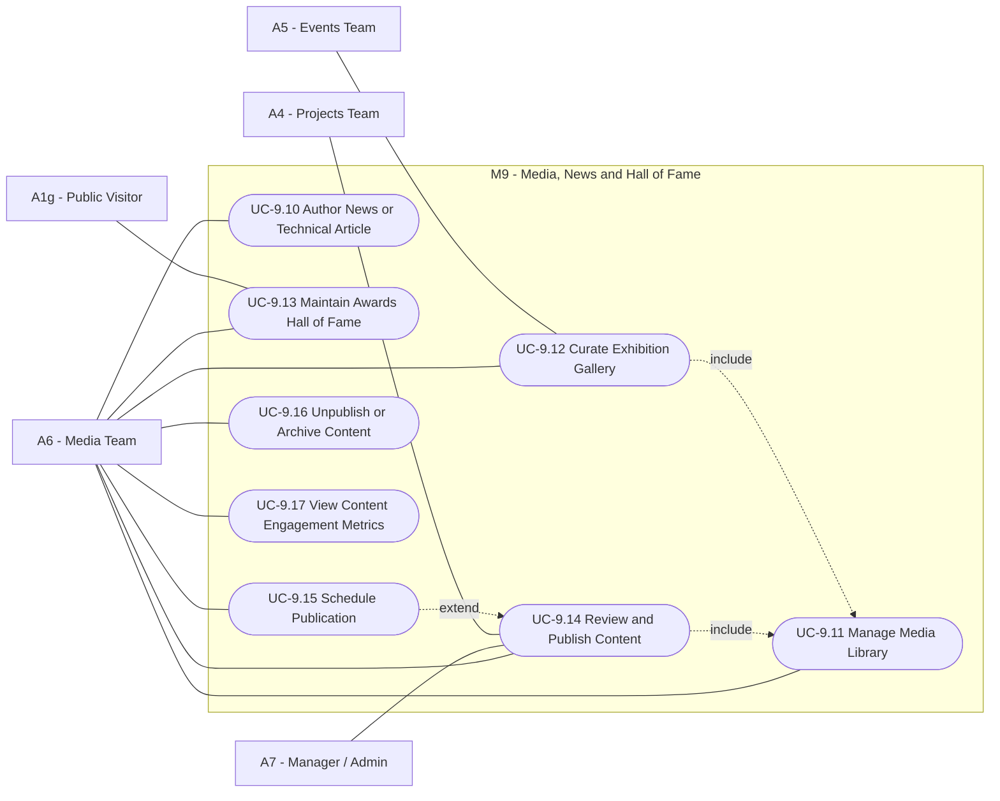

### 10.2 User Stories — A6

#### US-MED-01 — Author news and technical coverage `M`
> **As a** Media Team member, **I want to** write news items and technical articles with rich content, **so that** the club communicates its activity professionally.

**Acceptance Criteria**
- **Given** an article, **then** title, slug, summary, body, cover image, category, tags, author and language are captured.
- **Given** bilingual content, **then** Arabic and English variants are linked as one logical item and served per user locale.
- **Given** save, **then** the article is `DRAFT` and unreachable publicly, including by direct URL (BR-11).

#### US-MED-02 — Manage the media library `M`
> **As a** Media Team member, **I want** a central library of images and videos with metadata, **so that** assets are reusable and attributable.

**Acceptance Criteria**
- **Given** an upload, **then** caption, credit, capture date, related event/project and usage rights are recorded.
- **Given** a media item is referenced by published content, **then** deletion is blocked and the references are listed.
- **Given** the library, **then** it is searchable by tag, event, project and date range.

#### US-MED-03 — Curate exhibition galleries `S`
> **As a** Media Team member, **I want to** build curated galleries tied to events or projects, **so that** visitors can experience the club's activity visually.

**Acceptance Criteria**
- **Given** a gallery, **then** items are ordered explicitly and each carries a caption.
- **Given** a gallery linked to an event, **then** it is surfaced on that event's public page automatically.

#### US-MED-04 — Maintain the awards and achievements hall of fame `M`
> **As a** Media Team member, **I want to** record awards and achievements with evidence, **so that** the club's credibility is documented for sponsors and the university.

**Acceptance Criteria**
- **Given** an award entry, **then** awarding body, competition, level (local, national, international), rank, date, related project/team and evidence media are captured.
- **Given** a related project exists, **then** the award is cross-linked bidirectionally.
- **Given** the public hall of fame, **then** entries are sortable by date and level.

#### US-MED-05 — Review, publish, schedule and unpublish content `M`
> **As a** Media Team member, **I want to** control the publication lifecycle including scheduled release, **so that** communications are deliberate and correctable.

**Acceptance Criteria**
- **Given** a `PENDING_REVIEW` item, **then** I can approve, request changes with comments, or reject.
- **Given** a scheduled publication datetime, **then** S1 publishes at that moment and the item stays private until then.
- **Given** an unpublish action, **then** the item returns to `DRAFT`, is immediately removed from public routes, and the action is audited with reason.

#### US-MED-06 — View content engagement metrics `C`
> **As a** Media Team member, **I want to** see views and engagement per content item, **so that** I can focus on what resonates.

**Acceptance Criteria**
- **Given** the metrics view, **then** views over time, top items and referrer categories are shown per content type.
- **Given** metrics collection, **then** no personally identifying visitor data is retained beyond policy.

---

## 11. Actor A7 — Team Manager / System Admin

### 11.1 Use Case Diagram — Identity, RBAC, Audit & Analytics (UCD-10)

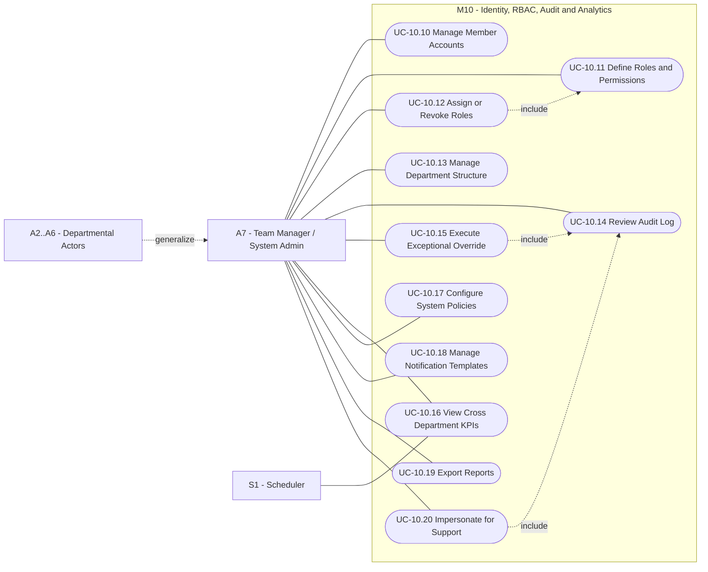

### 11.2 User Stories — A7

#### US-ADM-01 — Manage member accounts `M`
> **As the** Team Manager, **I want to** create, suspend and deactivate member accounts, **so that** only current members hold access.

**Acceptance Criteria**
- **Given** a new member, **then** identity, department, join date and initial roles are recorded.
- **Given** suspension, **then** all sessions are invalidated immediately and pending assignments are surfaced for reassignment.
- **Given** deactivation of a member holding hardware, **then** a warning lists outstanding custody and requires acknowledgement.

#### US-ADM-02 — Define roles and permissions dynamically `M`
> **As the** Team Manager, **I want to** define roles as sets of granular permissions without code changes, **so that** the club can restructure its departments freely.

**Acceptance Criteria**
- **Given** the RBAC editor, **then** permissions are listed by module with create/read/update/delete/approve granularity.
- **Given** a role change, **then** it takes effect for affected users on their next authorization check, and the change is audited (BR-09).
- **Given** an attempt to remove the last account holding `rbac.manage`, **then** the operation is blocked.

#### US-ADM-03 — Assign and revoke roles `M`
> **As the** Team Manager, **I want to** assign multiple roles per member with optional expiry, **so that** temporary responsibilities are handled safely.

**Acceptance Criteria**
- **Given** an assignment with an expiry date, **then** S1 revokes it automatically at expiry and notifies both parties.
- **Given** a member with several roles, **then** the effective permission set is the union, and a resolved-permissions view is available.
- **Given** any assignment or revocation, **then** it is written to the audit log with actor, target, before and after state.

#### US-ADM-04 — Manage department structure `S`
> **As the** Team Manager, **I want to** define departments and their leads, **so that** ownership and routing rules follow the real organization.

**Acceptance Criteria**
- **Given** a department, **then** name, mandate, lead and default roles are recorded.
- **Given** a department lead change, **then** approval routing updates for all pending items in that department.

#### US-ADM-05 — Review the immutable audit log `M`
> **As the** Team Manager, **I want to** search a tamper-evident audit trail, **so that** every privileged action is accountable.

**Acceptance Criteria**
- **Given** the audit view, **then** entries are filterable by actor, module, action type, target entity and date range.
- **Given** any entry, **then** it is append-only — no user, including me, can edit or delete it.
- **Given** an override or impersonation event, **then** it is highlighted as high-sensitivity.

#### US-ADM-06 — Execute exceptional overrides `M`
> **As the** Team Manager, **I want** final override authority on blocked operations, **so that** genuine exceptions do not stall the club — while remaining fully traceable.

**Acceptance Criteria**
- **Given** any override (clearance, completion threshold, waitlist order, liability waiver, certificate re-issue), **then** a written justification is mandatory.
- **Given** an override is executed, **then** the original blocking condition, the override reason and my identity are permanently attached to the affected record.
- **Given** a clearance override, **then** the resulting certificate is flagged internally as `issued under override` while remaining valid publicly.
- **Given** overrides are executed, **then** they are counted and surfaced as a governance KPI.

#### US-ADM-07 — View cross-departmental KPIs `M`
> **As the** Team Manager, **I want** one dashboard spanning all departments, **so that** I can steer the club with evidence.

**Acceptance Criteria**
- **Given** the dashboard, **then** it shows: admissions funnel and pass rates (M3/M4), asset utilization, overdue and loss rates (M5), clearance cycle time and certificates issued (M6), consultation volume, SLA compliance and satisfaction (M2), event attendance rates (M8), and publication cadence (M9).
- **Given** a KPI, **then** it is drillable to the underlying records subject to my permissions.
- **Given** a selected period, **then** all KPIs recompute consistently against that period.

#### US-ADM-08 — Configure system policies `S`
> **As the** Team Manager, **I want to** configure global policy values, **so that** operational rules can evolve without redevelopment.

**Acceptance Criteria**
- **Given** the policy editor, **then** offer expiry window, SLA durations, overdue escalation intervals, attendance minimum, low-stock thresholds and locale defaults are configurable.
- **Given** a policy change, **then** it applies prospectively and is audited; in-flight records retain the policy values captured at their creation.

#### US-ADM-09 — Manage notification templates `S`
> **As the** Team Manager, **I want to** edit bilingual notification templates with variables, **so that** communication stays on-brand and accurate.

**Acceptance Criteria**
- **Given** a template, **then** Arabic and English bodies with declared variables are stored and validated for unknown placeholders.
- **Given** a preview, **then** the rendered output with sample data is shown before saving.

#### US-ADM-10 — Export reports `S`
> **As the** Team Manager, **I want to** export departmental and cross-departmental reports, **so that** I can report upward to university leadership and sponsors.

**Acceptance Criteria**
- **Given** an export, **then** the file includes generation timestamp, generating actor and applied filters.
- **Given** an export containing personal data, **then** it requires the `analytics.pii` permission and is audited.

#### US-ADM-11 — Impersonate a user for support `C`
> **As the** Team Manager, **I want to** view the platform as a given user for troubleshooting, **so that** I can diagnose issues precisely.

**Acceptance Criteria**
- **Given** impersonation starts, **then** a persistent banner is displayed and the session is time-boxed.
- **Given** impersonation is active, **then** state-changing actions are blocked by default unless explicitly enabled with justification.
- **Given** the session, **then** start, end and every action are audited under both identities.

---

## 12. Traceability & Coverage Verification (Step 1 Internal Audit)

### 12.1 Brief Requirement → Story Coverage

| # | Requirement stated in the brief | Actor | Covered by |
|---|---|---|---|
| R-01 | Showcase professional identity to leadership, students, sponsors | A1, A6 | US-STU-01, US-MED-01, US-MED-04 |
| R-02 | Dynamic event agendas | A1, A5 | US-STU-03, US-EVT-01, US-EVT-02 |
| R-03 | Live exhibition galleries | A1, A6 | US-STU-04, US-MED-03 |
| R-04 | Showcase of achievements / awards | A1, A6 | US-STU-04, US-MED-04 |
| R-05 | Graduation project consultation gateway (matching) | A1, A4 | US-STU-17, US-STU-18, US-PRJ-05, US-PRJ-06, US-PRJ-07, US-PRJ-08 |
| R-06 | Full lifecycle management of technical courses | A2 | US-TRN-01, US-TRN-02, US-TRN-03, US-TRN-11, US-TRN-12 |
| R-07 | Automated screening tests | A1, A2 | US-STU-09, US-TRN-04, US-TRN-05 |
| R-08 | Evaluation scoring algorithms | A2, S4 | US-TRN-06, US-TRN-07, US-TRN-08 |
| R-09 | Accepted list, waiting list, automated notifications | A2, S1 | US-TRN-09, US-STU-11, US-STU-12, BR-03, BR-04 |
| R-10 | End-to-end hardware cataloguing | A3 | US-LOG-01, US-LOG-02, US-LOG-03 |
| R-11 | Checkout / check-in tracking | A3 | US-LOG-05, US-LOG-06, US-STU-13 |
| R-12 | Linkage of assets to students **and** project teams | A3, A4 | US-LOG-05, US-PRJ-09, US-EVT-06, BR-12 |
| R-13 | Condition logging: Healthy / Damaged / Lost | A3 | US-LOG-06, US-STU-14 |
| R-14 | **Certificate suppression until clearance (براءة ذمة)** | A3, A1 | **US-LOG-09, US-LOG-10, US-LOG-11, US-STU-15, BR-01, UCD-6** |
| R-15 | Students track personal hardware checkout status | A1 | US-STU-13, US-STU-14 |
| R-16 | Download validated certificates once cleared | A1 | US-STU-15, US-STU-16, BR-10 |
| R-17 | Training authors content and modules | A2 | US-TRN-01, US-TRN-02 |
| R-18 | Training formulates screening/quiz questions | A2 | US-TRN-04, US-TRN-05 |
| R-19 | Training reviews automated results | A2 | US-TRN-07 |
| R-20 | Training manages enrollment/acceptance statuses | A2 | US-TRN-08, US-TRN-09, US-TRN-12 |
| R-21 | Training generates attendance rosters | A2 | US-TRN-11 |
| R-22 | Logistics issues clearance approvals unlocking certificates | A3 | US-LOG-09, US-LOG-10 |
| R-23 | Projects documents technical projects & prototypes | A4 | US-PRJ-01, US-PRJ-02, US-PRJ-03, US-PRJ-04 |
| R-24 | Projects triages consultation requests to experts | A4 | US-PRJ-06, US-PRJ-07 |
| R-25 | Projects submits hardware requisitions to Logistics | A4 | US-PRJ-09, US-LOG-04 |
| R-26 | Events organizes workshops, exhibitions, hackathons | A5 | US-EVT-01, US-EVT-02 |
| R-27 | Events manages scheduling timelines | A5 | US-EVT-01, US-EVT-02, US-EVT-08 |
| R-28 | Events tracks registrations and attendance metrics | A5 | US-EVT-03, US-EVT-04, US-EVT-05, US-EVT-07 |
| R-29 | Media manages digital media and news | A6 | US-MED-01, US-MED-02 |
| R-30 | Media publishes technical coverage/articles | A6 | US-MED-01, US-MED-05 |
| R-31 | Media maintains awards / hall of fame | A6 | US-MED-04 |
| R-32 | Admin: full oversight | A7 | US-ADM-01, US-ADM-05, US-ADM-07 |
| R-33 | Admin: dynamic RBAC management | A7 | US-ADM-02, US-ADM-03, US-ADM-04, BR-09 |
| R-34 | Admin: cross-departmental analytics and KPIs | A7 | US-ADM-07, US-ADM-10 |
| R-35 | Admin: final override authority on exceptional cases | A7 | US-ADM-06, UC-6.13 |

**Coverage result: 35 / 35 stated requirements mapped. No orphan requirement, no orphan story.**

### 12.2 Story Count by Actor

| Actor | Stories | Must | Should | Could |
|---|---|---|---|---|
| A1 — External Student / Visitor | 19 | 11 | 7 | 1 |
| A2 — Training Team | 13 | 9 | 4 | 0 |
| A3 — Logistics Team | 13 | 8 | 4 | 1 |
| A4 — Projects Team | 9 | 5 | 4 | 0 |
| A5 — Events Team | 8 | 4 | 4 | 0 |
| A6 — Media Team | 6 | 4 | 1 | 1 |
| A7 — Manager / Admin | 11 | 5 | 5 | 1 |
| **Total** | **79** | **46** | **29** | **4** |

### 12.3 Cross-Module Dependency Check

| Dependency | From → To | Status |
|---|---|---|
| Screening result gates offer issuance | M4 → M3 | Modelled (BR-02, US-TRN-08/09) |
| Enrollment gates individual checkout | M3 → M5 | Modelled (BR-12, US-LOG-05) |
| Requisition gates team checkout | M7/M8 → M5 | Modelled (US-PRJ-09, US-EVT-06) |
| Check-in inspection creates liability | M5 → M5 | Modelled (BR-06, US-LOG-06/08) |
| Return + liability + completion gate clearance | M5 + M3 → M6 | Modelled (BR-01, US-LOG-09) |
| Clearance gates certificate generation | M6 → M6 | Modelled (BR-01, UCD-6 include chain) |
| Consultation SLA breach escalates to Admin | M2 → M10 | Modelled (BR-08, US-PRJ-06) |
| Every privileged action writes audit | all → M10 | Modelled (BR-09, US-ADM-05) |

---

## 13. Open Decisions Requiring Your Confirmation

These are **modelling decisions I made explicitly** so Step 2 and Step 3 do not inherit ambiguity. Please confirm or correct each before I proceed:

| # | Decision taken | Alternative |
|---|---|---|
| D-01 | Club **members** are modelled as `User` accounts holding one or more **roles**; a person can belong to two departments simultaneously (e.g. Projects + Media). | Strict single-department membership |
| D-02 | External students and members share a single `User` table distinguished by role/type, not two separate identity stores. | Separate external/internal identity |
| D-03 | Certificate issuance is scoped to an **enrollment** (course + student), not to a student globally. Clearance is likewise per enrollment. | Global clearance per student |
| D-04 | A student with an unresolved liability from cohort A is blocked from **new checkouts** but not automatically from cohort A's certificate — that certificate is blocked only by cohort A's own outstanding items unless you want global blocking. | Global cross-cohort certificate blocking |
| D-05 | Hardware may be held by a **student**, a **project team**, or an **event lead**; custody is always attributed to exactly one responsible party. | Individual custody only |
| D-06 | Consultation experts are club members surfaced through an **expertise directory** maintained by A4, not self-registered. | Self-service expert opt-in |
| D-07 | Screening is **optional per course**; courses without screening go straight from application to ranking on declared background. | Screening mandatory for all courses |
| D-08 | Content publication requires an explicit publish transition for all public entities (projects, events, articles, galleries). | Direct publish on save |

---

## 14. Phase Gate — Approval Request

**Step 1 is complete and internally consistent:**

- ✅ 7 primary actors + 4 secondary system actors catalogued with a generalization hierarchy
- ✅ 10 functional modules decomposed with clear ownership
- ✅ 12 governing business rules extracted and ID'd for downstream reference
- ✅ 79 user stories with explicit Given/When/Then acceptance criteria, covering every role in every functional area
- ✅ 11 UML use case diagrams (UCD-0 … UCD-10) in Mermaid.js, with system boundaries, `<<include>>`, `<<extend>>` and generalization relationships
- ✅ Full requirement→story traceability: 35/35 brief requirements mapped, zero gaps
- ✅ The Clearance Lock (BR-01) is structurally enforced in the use case model — no certificate path bypasses `UC-6.11`

**Requested from you before Step 2:**
1. Confirmation or correction of decisions **D-01 … D-08** in §13.
2. Any missing role capability or story you want added.
3. Approval to proceed to **Step 2 — Business Logic & Operational Workflows**, which will deliver UML Activity Diagrams for: the mandatory end-to-end flow (Application → Screening → Acceptance → Checkout → Completion → Return/Audit → Clearance → Certificate), the requisition and custody flow, the consultation triage flow, the liability resolution flow, and the RBAC authorization flow — plus the full state machines for `Application`, `Enrollment`, `AssetUnit`, `Checkout`, `ClearanceRecord` and `Certificate`.

*No tech stack, framework, or implementation architecture will be proposed until Steps 2, 3 and 4 are audited and approved.*
