# HMK Platform — Phase 1 / Steps 2 & 3
## Business Logic, Operational Workflows & Enterprise Data Model
**Project:** HMK Robotics and AI Club Platform (نادي الهمك للذكاء الصنعي والروبوتيك)
**Document ID:** HMK-SA-P1-S2S3
**Predecessor:** HMK-SA-P1-S1 (Use Cases & User Stories — 79 stories, 11 UCDs)
**Phase Gate:** Behavioural + Structural modelling. **No technology selection, no implementation code.**

---

# PART A — Architecture Decision Register (D-01 … D-08)

Each decision is stated with the recommended default, the reasoning from standard enterprise portal practice, and the structural consequence that flows into the ERD in Part C.

## A.1 Decision Summary

| ID | Question | **Recommended Default** | Standard practice rationale |
|---|---|---|---|
| **D-01** | Can a member belong to multiple departments? | **Yes — multi-role, multi-department, with expiry** | Role assignment is a *relationship*, not an attribute. Volunteer organizations have inherent overlap (a Projects member who also shoots media). Modelling it as 1:N forces duplicate accounts, which destroys audit integrity. |
| **D-02** | One identity store or two? | **One `users` table, discriminated by `user_type`, extended by profile tables** | Single-identity is the near-universal enterprise pattern. A student may later become a member — with two stores that transition means data migration and a broken audit trail. Party/role modelling keeps identity stable and lets affiliation change. |
| **D-03** | Is clearance scoped per enrollment or per student? | **Per enrollment (with a global advisory gate — see A.2)** | A certificate attests to *one course*. Coupling its issuance to a student's entire lifetime obligations makes the credential's validity depend on unrelated facts. |
| **D-04** | Does a liability in cohort A block the certificate for cohort B? | **No hard block; a *soft* global gate that blocks new checkouts and raises an approval flag — see A.2** | Two-tier enforcement is the standard compromise between fairness and leverage. |
| **D-05** | Who can hold custody? | **Student, project team, or event lead — always exactly one accountable party per checkout** | Custody must resolve to a single natural person for enforceability, but the *reason* for custody differs. Modelled as `custody_type` + a mutually-exclusive context FK guarded by a CHECK constraint. |
| **D-06** | Are consultation experts curated or self-registered? | **Curated by A4, with member-initiated availability toggle** | Quality gate on outward-facing engagement, without the Projects Team having to manage each expert's day-to-day availability. |
| **D-07** | Is screening mandatory for all courses? | **Optional per course (`requires_screening` flag)** | A 3D-printing induction does not need the same gate as an embedded-AI course. Making it optional avoids fake tests created purely to satisfy the pipeline. |
| **D-08** | Does public content require an explicit publish transition? | **Yes, for every public entity, with an optional scheduled release** | Editorial governance (BR-11). Draft-by-default is the safe default; direct-publish-on-save is how clubs accidentally expose half-written pages to sponsors. |

## A.2 Critical Trade-off Analysis — D-03 and D-04

These two are the only decisions in the register with a genuine, non-obvious cost either way. They deserve explicit treatment because they determine whether `ClearanceRecord` hangs off `Enrollment` (1:1) or off `User` (1:N), and that choice is expensive to reverse after data exists.

### D-03 — Clearance scope

| | **Option A: Per enrollment** *(recommended)* | **Option B: Per student, global** |
|---|---|---|
| Cardinality | `enrollment 1 —— 1 clearance_record` | `user 1 —— N clearance_record` (or 1—1 with a rolling state) |
| Semantics | "This student has settled everything owed *for this course*." | "This student owes the club nothing at all." |
| Certificate integrity | Certificate validity is stable once issued — it can never be invalidated by a future unrelated loan. | A certificate's basis can be retroactively undermined by an event that has nothing to do with the course it attests to. |
| Concurrency | A student in two cohorts simultaneously gets two independent clearance tracks. Clean. | Two cohorts share one clearance state → completing cohort A is blocked by cohort B's still-active, entirely legitimate loan. **This is the fatal flaw.** |
| Audit | The clearance snapshot names exactly which checkouts were verified. Provable. | Snapshot must enumerate the student's whole custody history at that moment. Grows unbounded. |
| Operational cost | Logistics must approve once per enrollment (more clicks). | One approval covers everything (fewer clicks). |
| Reversal cost | Low — a global view is derivable from per-enrollment records. | **High** — per-enrollment history cannot be reconstructed from a global flag. |

**Recommendation: Option A.** The decisive argument is concurrency: a student enrolled in "Arduino" and "PCB Design" at the same time will, under Option B, be unable to receive the Arduino certificate because the PCB kit is still legitimately checked out and not yet due. That is not a rule the club wants — it punishes engagement. Option A also satisfies the reversibility test: you can always compute a global "owes nothing" view on top of per-enrollment records, but you can never split a global flag back into per-course facts.

### D-04 — Cross-cohort liability blocking

The real question here is *leverage*: if a student damaged a kit in cohort A and refuses to settle, does the club have any hold over them in cohort B?

| | **Option A: Hard global block** | **Option B: No cross-cohort effect** | **Option C: Two-tier soft gate** *(recommended)* |
|---|---|---|---|
| Effect on cohort B certificate | Blocked | Unaffected | Unaffected — but an `OUTSTANDING_ELSEWHERE` advisory appears on the approval screen |
| Effect on new checkouts | Blocked | Not blocked | **Blocked** — no new hardware while a liability is unresolved |
| Leverage over a non-paying student | Maximum | None | Strong: they can finish courses but cannot borrow anything |
| Fairness risk | High — punishes an unrelated achievement; a disputed liability can hold a certificate hostage indefinitely | Low | Low |
| Escalation path | Implicit and rigid | Absent | Explicit: the advisory lets A3 withhold deliberately, or A7 override — a human decision, recorded |
| Rule complexity | Simple to state, harsh in practice | Simple, toothless | One extra rule, one extra advisory field |

**Recommendation: Option C.** Custody is the right lever, not certification. Blocking further borrowing is immediate, proportionate, and self-enforcing; blocking an earned credential is disproportionate and creates exactly the kind of dispute that ends up on A7's desk anyway. Option C keeps the certificate rule clean (BR-01 stays purely per-enrollment) while giving Logistics real teeth, and it surfaces the cross-cohort fact to the human approver rather than hiding it inside an automatic denial.

**Structural consequence:** this introduces **BR-13**, formalized in Part B, and adds an advisory (non-blocking) evaluation branch to the clearance approval screen — *not* to the certificate generation guard. The certificate guard remains a hard, per-enrollment gate with no advisory inputs.

## A.3 Consequences Propagated into Parts B and C

| Decision | Structural consequence |
|---|---|
| D-01 | `user_roles` is a first-class table with `department_id` and `expires_at`, not a column on `users`. |
| D-02 | `users` + `student_profiles` + `member_profiles` (1:0..1 vertical partitioning by `user_type`). |
| D-03 | `clearance_records.enrollment_id` is **UNIQUE** → strict 1:1 with `enrollments`. |
| D-04 | New rule BR-13; `liability_records` gates `checkouts` (hard) and annotates `clearance_records` (advisory). |
| D-05 | `checkouts.custody_type` enum + mutually-exclusive context FKs enforced by CHECK. |
| D-06 | `member_expertise` is curated (`created_by` = A4) but carries a member-editable `is_available`. |
| D-07 | `courses.requires_screening bool`; the screening branch in AD-1 is conditional. |
| D-08 | Every public entity carries `publication_status` + `published_at` + `published_by`; `scheduled_publish_at` where applicable. |

---

# PART B — Step 2: Business Logic & Operational Workflows

## B.1 Business Rule Set (Consolidated, with BR-13 added)

| ID | Rule | Type | Enforcement layer |
|---|---|---|---|
| BR-01 | Certificate generation requires an `APPROVED` clearance for **that enrollment**. | Hard invariant | DB constraint + domain service |
| BR-02 | Offers require normalized score ≥ cohort pass threshold when screening is required. | Hard guard | Domain service |
| BR-03 | Seats allocated in descending readiness order; overflow → ranked waitlist. | Algorithm | Domain service, transactional |
| BR-04 | Unconfirmed offers expire after `offer_confirmation_hours`; highest waitlist rank auto-promoted. | Scheduled | S1 job |
| BR-05 | Completion requires attendance ≥ `min_attendance_pct` **and** all required evaluations passed. | Hard guard, A7-overridable | Domain service |
| BR-06 | `Damaged` / `Lost` check-in opens a `liability_record` that must reach a terminal resolution. | Hard invariant | Domain service |
| BR-07 | A serialized asset unit has at most one `ACTIVE` checkout line. | Hard invariant | Partial unique index |
| BR-08 | Consultation requests must be triaged within SLA; breach escalates to A7. | Scheduled | S1 job |
| BR-09 | Every permission-bearing action is authorized against the live matrix and audited. | Cross-cutting | Authorization + audit interceptor |
| BR-10 | Certificates carry a unique, non-guessable verification code. | Hard invariant | Unique index + secure random |
| BR-11 | Public entities require an explicit publish transition. | State guard | Domain service |
| BR-12 | Custody requires an active enrollment (individual) or an approved requisition (team/event). | Hard guard | CHECK + domain service |
| **BR-13** | **An unresolved liability blocks *new checkouts* for that holder anywhere in the system, and raises a non-blocking advisory on any other enrollment's clearance screen. It never blocks another enrollment's certificate.** | Hard guard (custody) + advisory (clearance) | Domain service |

## B.2 Decision Table — Clearance Precondition Evaluation (`UC-6.10`)

Evaluated for exactly one `enrollment`. Every condition must be `PASS` for approval to be enabled.

| # | Condition | Source | Failure code surfaced to student |
|---|---|---|---|
| C1 | Enrollment status = `COMPLETED` | `enrollments.status` | `NOT_COMPLETED` |
| C2 | No checkout line for this enrollment in status `ACTIVE` or `OVERDUE` | `checkout_lines` | `ITEMS_OUTSTANDING` (itemized) |
| C3 | Every returned line has a recorded `condition_at_return` | `checkout_lines` | `INSPECTION_PENDING` |
| C4 | No `liability_record` for this enrollment in a non-terminal status | `liability_records` | `LIABILITY_OPEN` (itemized) |
| C5 | No `asset_incident` for this enrollment still `OPEN` | `asset_incidents` | `INCIDENT_OPEN` |
| A1 | *(advisory only — BR-13)* Holder has open liabilities on **other** enrollments | `liability_records` | not shown to student; shown to A3/A7 as `OUTSTANDING_ELSEWHERE` |

**Truth rule:** `approval_enabled = C1 ∧ C2 ∧ C3 ∧ C4 ∧ C5`. `A1` is excluded from the conjunction by design (D-04 / Option C).

## B.3 Master Workflow — Mandatory End-to-End Flow (AD-1)

Application → Screening → Acceptance → Checkout → Completion → Return & Audit → Clearance → Certificate.

```mermaid
flowchart TD
    START(("Start")) --> P1

    subgraph PH1["Phase 1 - Application"]
        P1["A1 browses catalogue and submits application"]
        P2{"Application window open<br/>and profile verified?"}
        P3["Reject submission with reason"]
        P4["Create application in SUBMITTED"]
        P5{"Course requires screening?"}
    end

    P1 --> P2
    P2 -->|No| P3 --> ENDX(("End - Not Applied"))
    P2 -->|Yes| P4 --> P5

    subgraph PH2["Phase 2 - Screening and Scoring"]
        S1N["Set state AWAITING_SCREENING and issue test invitation"]
        S2N["A1 takes timed screening attempt"]
        S3N["S4 auto grades objective items"]
        S4N{"Open ended items present?"}
        S5N["A2 grades open items manually"]
        S6N["Compute weighted readiness score"]
        S7N["A2 reviews and optionally overrides with audit"]
        S8N["Set state UNDER_EVALUATION"]
    end

    P5 -->|Yes| S1N --> S2N --> S3N --> S4N
    S4N -->|Yes| S5N --> S6N
    S4N -->|No| S6N
    S6N --> S7N --> S8N --> R1
    P5 -->|No| SB1["Score from declared background factors only"] --> S8N

    subgraph PH3["Phase 3 - Ranking, Offer and Enrollment"]
        R1["A2 ranks applicant pool descending"]
        R2{"Score at or above<br/>pass threshold?"}
        R3["Set REJECTED with reason and notify"]
        R4{"Rank within capacity?"}
        R5["Issue OFFER with expiry deadline and notify"]
        R6["Set WAITLISTED with preserved rank and notify"]
        R7{"Confirmed before deadline?"}
        R8["Set EXPIRED or DECLINED"]
        R9["S1 auto promotes top waitlisted applicant"]
        R10["Create ENROLLMENT and decrement seats atomically"]
    end

    R1 --> R2
    R2 -->|No| R3 --> ENDY(("End - Rejected"))
    R2 -->|Yes| R4
    R4 -->|No| R6 --> R9
    R4 -->|Yes| R5 --> R7
    R7 -->|No| R8 --> R9
    R9 --> R5
    R7 -->|Yes| R10 --> H1

    subgraph PH4["Phase 4 - Hardware Issuance"]
        H1["A2 requisitions cohort kit from A3"]
        H2{"A3 approves and stock available?"}
        H3["Notify shortfall and hold or partially fulfil"]
        H4["A3 reserves stock"]
        H5{"Holder has unresolved liability<br/>anywhere? BR-13"}
        H6["Block checkout - require settlement or A7 override"]
        H7["A3 executes checkout linked to enrollment"]
        H8["Record condition at issue, due date, issuing officer"]
        H9["A1 acknowledges custody receipt"]
    end

    H1 --> H2
    H2 -->|No| H3 --> H2
    H2 -->|Yes| H4 --> H5
    H5 -->|Yes| H6 --> H5
    H5 -->|No| H7 --> H8 --> H9 --> T1

    subgraph PH5["Phase 5 - Delivery and Completion"]
        T1["A2 delivers sessions and records attendance"]
        T2{"Attendance at or above minimum<br/>and evaluations passed? BR-05"}
        T3{"A7 grants documented override?"}
        T4["Enrollment remains ACTIVE or set NOT_COMPLETED"]
        T5["A2 marks enrollment COMPLETED"]
        T6["Notify A3 that assets are now due"]
    end

    T1 --> T2
    T2 -->|No| T3
    T3 -->|No| T4 --> ENDZ(("End - Not Completed"))
    T3 -->|Yes| T5
    T2 -->|Yes| T5 --> T6 --> A1N

    subgraph PH6["Phase 6 - Return and Inspection Audit"]
        A1N["A1 returns hardware to A3"]
        A2N["A3 records check in per line"]
        A3N{"Verified condition?"}
        A4N["Return unit to available stock"]
        A5N["Set unit UNDER_REPAIR and open liability"]
        A6N["Set unit LOST and open liability"]
        A7N{"All lines for this enrollment closed?"}
        A8N["Remaining lines stay outstanding"]
    end

    A1N --> A2N --> A3N
    A3N -->|Healthy| A4N --> A7N
    A3N -->|Damaged| A5N --> L1
    A3N -->|Lost| A6N --> L1
    A7N -->|No| A8N --> A1N
    A7N -->|Yes| CL1

    subgraph PH7["Phase 7 - Liability Resolution"]
        L1["Liability record opened with assessed value"]
        L2{"Resolution type"}
        L3["Repaired or Replaced - evidence recorded"]
        L4["Fee settled - receipt recorded"]
        L5["Waived by A7 with mandatory justification"]
        L6["Liability set RESOLVED"]
    end

    L2 -->|Repair or Replace| L3 --> L6
    L2 -->|Settle| L4 --> L6
    L2 -->|Waive| L5 --> L6
    L1 --> L2
    L6 --> A7N

    subgraph PH8["Phase 8 - Clearance Validation - BR-01 Gate"]
        CL1["Re-evaluate clearance preconditions C1 to C5"]
        CL2{"All preconditions PASS?"}
        CL3["A3 withholds clearance and publishes itemized reasons"]
        CL4["Show advisory OUTSTANDING_ELSEWHERE to A3 - non blocking"]
        CL5["A3 approves clearance - snapshot stored with approver identity"]
        CL6{"A7 exceptional override?"}
        CL7["Clearance APPROVED flagged is_override with justification"]
    end

    CL1 --> CL2
    CL2 -->|No| CL3 --> CL6
    CL6 -->|No| ENDW(("End - Certificate Withheld"))
    CL6 -->|Yes| CL7 --> CT1
    CL2 -->|Yes| CL4 --> CL5 --> CT1

    subgraph PH9["Phase 9 - Certificate Issuance"]
        CT1["Generate certificate document via S3"]
        CT2["Assign unique verification code and serial"]
        CT3["Persist certificate linked 1:1 to clearance and enrollment"]
        CT4["Publish public verification record"]
        CT5["Notify A1 that certificate is available"]
        CT6["A1 downloads certificate"]
    end

    CT1 --> CT2 --> CT3 --> CT4 --> CT5 --> CT6 --> FIN(("End - Certified"))
```

> **Gate assertion.** There are exactly two arcs entering `PH9`: one from `CL5` (normal approval) and one from `CL7` (A7 override, permanently flagged). No arc from `PH5`, `PH6`, or `PH7` reaches certificate generation directly. BR-01 is therefore structurally, not procedurally, enforced.

## B.4 Screening & Scoring Sub-workflow (AD-2)

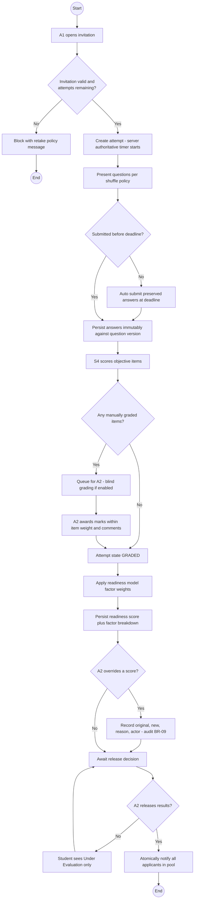
```mermaid
flowchart TD
    A(("Start")) --> B["A1 opens invitation"]
    B --> C{"Invitation valid and<br/>attempts remaining?"}
    C -->|No| D["Block with retake policy message"] --> Z(("End"))
    C -->|Yes| E["Create attempt - server authoritative timer starts"]
    E --> F["Present questions per shuffle policy"]
    F --> G{"Submitted before deadline?"}
    G -->|No| H["Auto submit preserved answers at deadline"] --> I
    G -->|Yes| I["Persist answers immutably against question version"]
    I --> J["S4 scores objective items"]
    J --> K{"Any manually graded items?"}
    K -->|Yes| L["Queue for A2 - blind grading if enabled"]
    L --> M["A2 awards marks within item weight and comments"]
    K -->|No| N
    M --> N["Attempt state GRADED"]
    N --> O["Apply readiness model factor weights"]
    O --> P["Persist readiness score plus factor breakdown"]
    P --> Q{"A2 overrides a score?"}
    Q -->|Yes| R["Record original, new, reason, actor - audit BR-09"] --> S
    Q -->|No| S["Await release decision"]
    S --> T{"A2 releases results?"}
    T -->|No| U["Student sees Under Evaluation only"] --> S
    T -->|Yes| V["Atomically notify all applicants in pool"] --> W(("End"))
```

## B.5 Seat Allocation, Offer Expiry & Waitlist Promotion (AD-3)

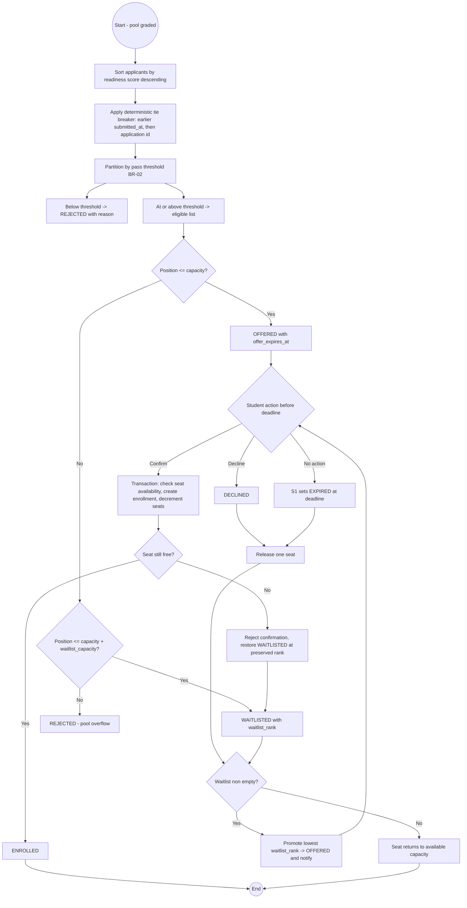
```mermaid
flowchart TD
    A(("Start - pool graded")) --> B["Sort applicants by readiness score descending"]
    B --> C["Apply deterministic tie breaker: earlier submitted_at, then application id"]
    C --> D["Partition by pass threshold BR-02"]
    D --> E["Below threshold -> REJECTED with reason"]
    D --> F["At or above threshold -> eligible list"]
    F --> G{"Position <= capacity?"}
    G -->|Yes| H["OFFERED with offer_expires_at"]
    G -->|No| I{"Position <= capacity + waitlist_capacity?"}
    I -->|Yes| J["WAITLISTED with waitlist_rank"]
    I -->|No| K["REJECTED - pool overflow"]
    H --> L{"Student action before deadline"}
    L -->|Confirm| M["Transaction: check seat availability, create enrollment, decrement seats"]
    M --> N{"Seat still free?"}
    N -->|No| O["Reject confirmation, restore WAITLISTED at preserved rank"] --> J
    N -->|Yes| P["ENROLLED"] --> Q(("End"))
    L -->|Decline| R["DECLINED"] --> S
    L -->|No action| T["S1 sets EXPIRED at deadline"] --> S
    S["Release one seat"] --> U{"Waitlist non empty?"}
    U -->|Yes| V["Promote lowest waitlist_rank -> OFFERED and notify"] --> L
    U -->|No| W["Seat returns to available capacity"] --> Q
    J --> U
```

## B.6 Requisition → Reservation → Custody (AD-4)

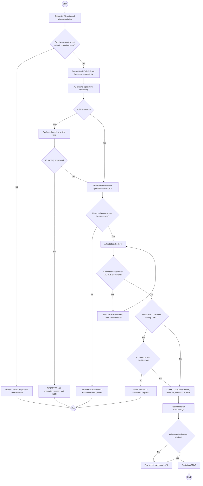
```mermaid
flowchart TD
    A(("Start")) --> B["Requester A2, A4 or A5 raises requisition"]
    B --> C{"Exactly one context set:<br/>cohort, project or event?"}
    C -->|No| D["Reject - invalid requisition context BR-12"] --> Z(("End"))
    C -->|Yes| E["Requisition PENDING with lines and required_by"]
    E --> F["A3 reviews against live availability"]
    F --> G{"Sufficient stock?"}
    G -->|No| H["Surface shortfall at review time"]
    H --> I{"A3 partially approves?"}
    I -->|No| J["REJECTED with mandatory reason and notify"] --> Z
    I -->|Yes| K
    G -->|Yes| K["APPROVED - reserve quantities with expiry"]
    K --> L{"Reservation consumed before expiry?"}
    L -->|No| M["S1 releases reservation and notifies both parties"] --> Z
    L -->|Yes| N["A3 initiates checkout"]
    N --> O{"Serialized unit already ACTIVE elsewhere?"}
    O -->|Yes| P["Block - BR-07 violation, show current holder"] --> N
    O -->|No| Q{"Holder has unresolved liability? BR-13"}
    Q -->|Yes| R{"A7 override with justification?"}
    R -->|No| S["Block checkout - settlement required"] --> Z
    R -->|Yes| T
    Q -->|No| T["Create checkout with lines, due date, condition at issue"]
    T --> U["Notify holder to acknowledge"]
    U --> V{"Acknowledged within window?"}
    V -->|No| W["Flag unacknowledged to A3"] --> V
    V -->|Yes| X["Custody ACTIVE"] --> Y(("End"))
```

## B.7 Check-In, Inspection & Liability Resolution (AD-5)

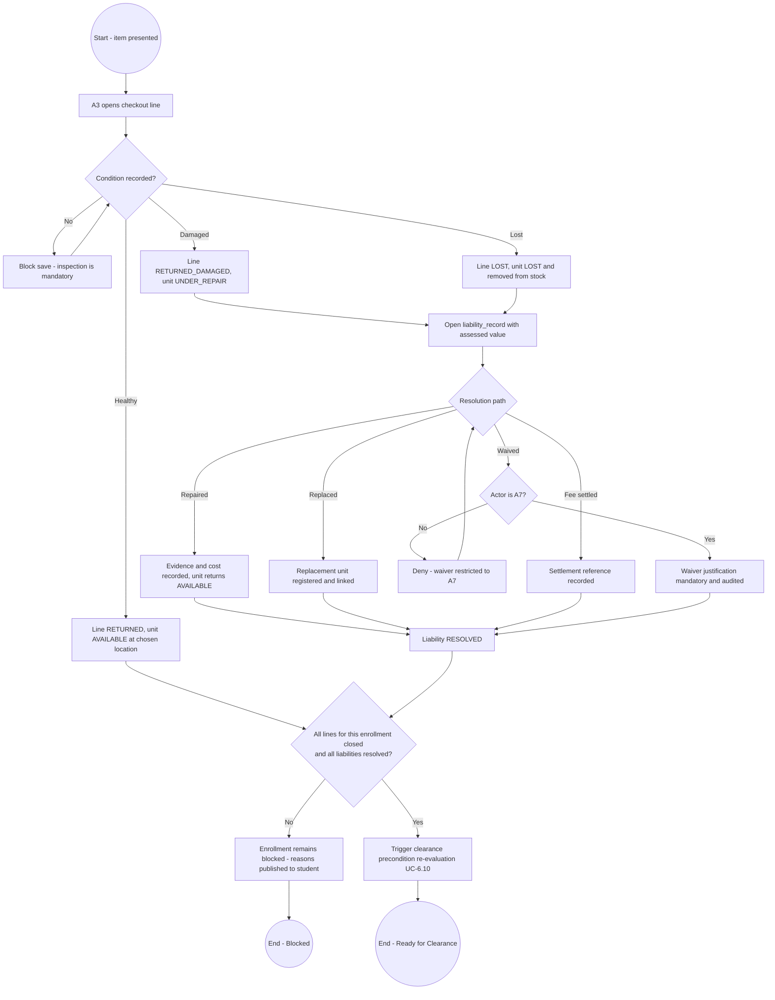
```mermaid
flowchart TD
    A(("Start - item presented")) --> B["A3 opens checkout line"]
    B --> C{"Condition recorded?"}
    C -->|No| D["Block save - inspection is mandatory"] --> C
    C -->|Healthy| E["Line RETURNED, unit AVAILABLE at chosen location"]
    C -->|Damaged| F["Line RETURNED_DAMAGED, unit UNDER_REPAIR"]
    C -->|Lost| G["Line LOST, unit LOST and removed from stock"]
    E --> H
    F --> I["Open liability_record with assessed value"]
    G --> I
    I --> J{"Resolution path"}
    J -->|Repaired| K["Evidence and cost recorded, unit returns AVAILABLE"]
    J -->|Replaced| L["Replacement unit registered and linked"]
    J -->|Fee settled| M["Settlement reference recorded"]
    J -->|Waived| N{"Actor is A7?"}
    N -->|No| O["Deny - waiver restricted to A7"] --> J
    N -->|Yes| P["Waiver justification mandatory and audited"]
    K --> Q
    L --> Q
    M --> Q
    P --> Q["Liability RESOLVED"]
    Q --> H{"All lines for this enrollment closed<br/>and all liabilities resolved?"}
    H -->|No| R["Enrollment remains blocked - reasons published to student"] --> S(("End - Blocked"))
    H -->|Yes| T["Trigger clearance precondition re-evaluation UC-6.10"] --> U(("End - Ready for Clearance"))
```

## B.8 Clearance Validation & Certificate Generation (AD-6) — the BR-01 gate in detail

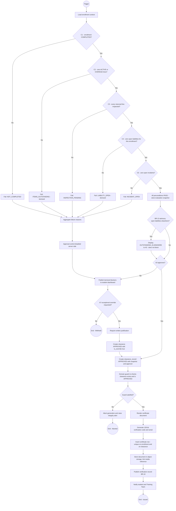
```mermaid
flowchart TD
    A(("Trigger")) --> B["Load enrollment context"]
    B --> C{"C1 - enrollment COMPLETED?"}
    C -->|No| F1["Fail: NOT_COMPLETED"]
    C -->|Yes| D{"C2 - zero ACTIVE or OVERDUE lines?"}
    D -->|No| F2["Fail: ITEMS_OUTSTANDING - itemized"]
    D -->|Yes| E{"C3 - every returned line inspected?"}
    E -->|No| F3["Fail: INSPECTION_PENDING"]
    E -->|Yes| G{"C4 - zero open liabilities for this enrollment?"}
    G -->|No| F4["Fail: LIABILITY_OPEN - itemized"]
    G -->|Yes| H{"C5 - zero open incidents?"}
    H -->|No| F5["Fail: INCIDENT_OPEN"]
    H -->|Yes| I["All preconditions PASS - store evaluation snapshot"]

    F1 --> FX["Aggregate failure reasons"]
    F2 --> FX
    F3 --> FX
    F4 --> FX
    F5 --> FX
    FX --> J["Approval control disabled server side"]
    J --> K["Publish itemized blockers to student dashboard"]
    K --> L{"A7 exceptional override requested?"}
    L -->|No| M(("End - Withheld"))
    L -->|Yes| N["Require written justification"]
    N --> O["Create clearance APPROVED with is_override true"] --> Q

    I --> P1{"BR-13 advisory:<br/>open liabilities elsewhere?"}
    P1 -->|Yes| P2["Display OUTSTANDING_ELSEWHERE to A3 - does not block"] --> P3
    P1 -->|No| P3{"A3 approves?"}
    P3 -->|No| K
    P3 -->|Yes| Q["Create clearance_record APPROVED with snapshot and approver"]

    Q --> R["Domain guard re-checks clearance exists and is APPROVED"]
    R --> S{"Guard satisfied?"}
    S -->|No| T["Abort generation and raise integrity alert"] --> U(("End - Aborted"))
    S -->|Yes| V["Render certificate document"]
    V --> W["Generate 128 bit verification code and serial"]
    W --> X["Insert certificate row - unique on enrollment and on clearance"]
    X --> Y["Store document in object storage, link media reference"]
    Y --> Z1["Publish verification record BR-10"]
    Z1 --> Z2["Notify student and Training Team"]
    Z2 --> Z3(("End - Issued"))
```

## B.9 Consultation Triage & Expert Matching (AD-7)

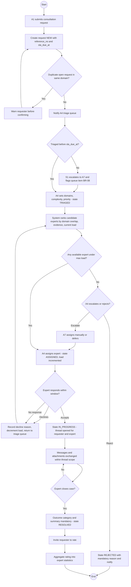
```mermaid
flowchart TD
    A(("Start")) --> B["A1 submits consultation request"]
    B --> C["Create request NEW with reference_no and sla_due_at"]
    C --> D{"Duplicate open request in same domain?"}
    D -->|Yes| E["Warn requester before confirming"] --> C
    D -->|No| F["Notify A4 triage queue"]
    F --> G{"Triaged before sla_due_at?"}
    G -->|No| H["S1 escalates to A7 and flags queue item BR-08"] --> I
    G -->|Yes| I["A4 sets domains, complexity, priority - state TRIAGED"]
    I --> J["System ranks candidate experts by domain overlap, evidence, current load"]
    J --> K{"Any available expert under max load?"}
    K -->|No| L{"A4 escalates or rejects?"}
    L -->|Reject| M["State REJECTED with mandatory reason and notify"] --> Z(("End"))
    L -->|Escalate| N["A7 assigns manually or defers"] --> O
    K -->|Yes| O["A4 assigns expert - state ASSIGNED, load incremented"]
    O --> P{"Expert responds within window?"}
    P -->|Declines| Q["Record decline reason, decrement load, return to triage queue"] --> J
    P -->|No response| Q
    P -->|Accepts| R["State IN_PROGRESS - thread opened for requester and expert"]
    R --> S["Messages and attachments exchanged within thread scope"]
    S --> T{"Expert closes case?"}
    T -->|No| S
    T -->|Yes| U["Outcome category and summary mandatory - state RESOLVED"]
    U --> V["Invite requester to rate"]
    V --> W["Aggregate rating into expert statistics"] --> Z
```

## B.10 Event Registration & Attendance (AD-8)

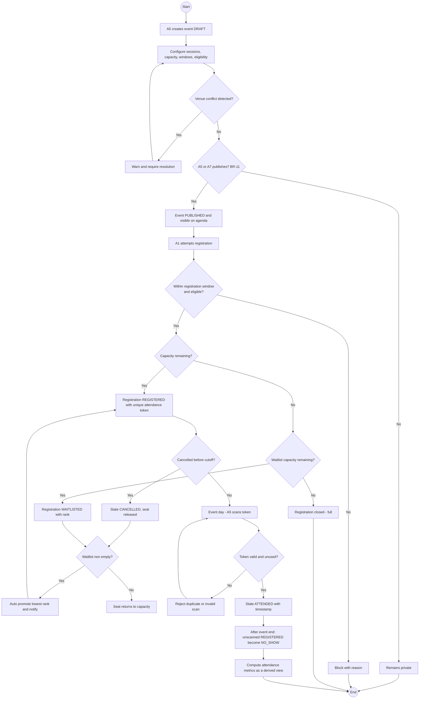
```mermaid
flowchart TD
    A(("Start")) --> B["A5 creates event DRAFT"]
    B --> C["Configure sessions, capacity, windows, eligibility"]
    C --> D{"Venue conflict detected?"}
    D -->|Yes| E["Warn and require resolution"] --> C
    D -->|No| F{"A5 or A7 publishes? BR-11"}
    F -->|No| G["Remains private"] --> Z(("End"))
    F -->|Yes| H["Event PUBLISHED and visible on agenda"]
    H --> I["A1 attempts registration"]
    I --> J{"Within registration window<br/>and eligible?"}
    J -->|No| K["Block with reason"] --> Z
    J -->|Yes| L{"Capacity remaining?"}
    L -->|Yes| M["Registration REGISTERED with unique attendance token"]
    L -->|No| N{"Waitlist capacity remaining?"}
    N -->|No| O["Registration closed - full"] --> Z
    N -->|Yes| P["Registration WAITLISTED with rank"]
    M --> Q{"Cancelled before cutoff?"}
    Q -->|Yes| R["State CANCELLED, seat released"] --> S
    S{"Waitlist non empty?"} -->|Yes| T["Auto promote lowest rank and notify"] --> M
    S -->|No| U["Seat returns to capacity"]
    P --> S
    Q -->|No| V["Event day - A5 scans token"]
    V --> W{"Token valid and unused?"}
    W -->|No| X["Reject duplicate or invalid scan"] --> V
    W -->|Yes| Y["State ATTENDED with timestamp"]
    Y --> AA["After event end: unscanned REGISTERED become NO_SHOW"]
    AA --> AB["Compute attendance metrics as a derived view"] --> Z
```

## B.11 Content Publication Governance (AD-9)

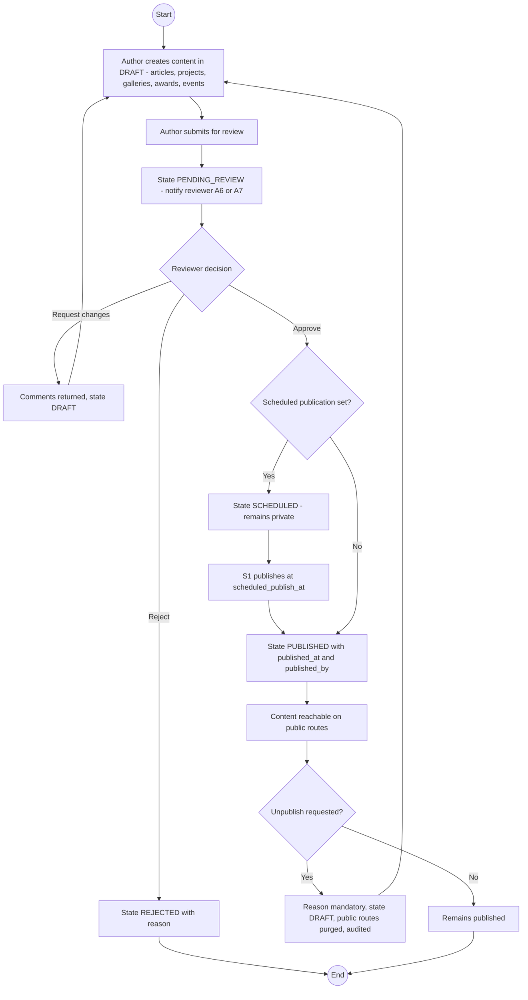
```mermaid
flowchart TD
    A(("Start")) --> B["Author creates content in DRAFT - articles, projects, galleries, awards, events"]
    B --> C["Author submits for review"]
    C --> D["State PENDING_REVIEW - notify reviewer A6 or A7"]
    D --> E{"Reviewer decision"}
    E -->|Request changes| F["Comments returned, state DRAFT"] --> B
    E -->|Reject| G["State REJECTED with reason"] --> Z(("End"))
    E -->|Approve| H{"Scheduled publication set?"}
    H -->|Yes| I["State SCHEDULED - remains private"]
    I --> J["S1 publishes at scheduled_publish_at"] --> K
    H -->|No| K["State PUBLISHED with published_at and published_by"]
    K --> L["Content reachable on public routes"]
    L --> M{"Unpublish requested?"}
    M -->|Yes| N["Reason mandatory, state DRAFT, public routes purged, audited"] --> B
    M -->|No| O["Remains published"] --> Z
```

## B.12 Authorization & Audit Cross-Cutting Flow (AD-10)

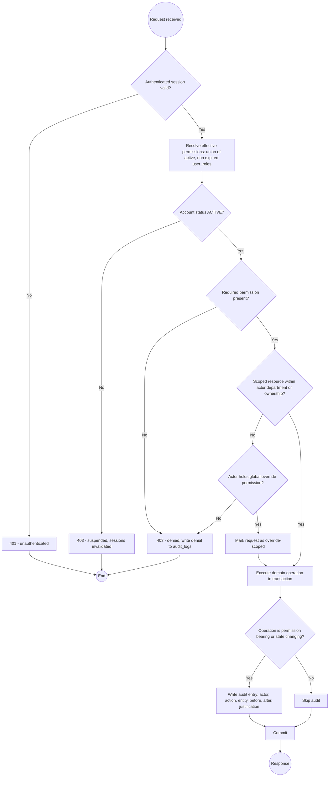
```mermaid
flowchart TD
    A(("Request received")) --> B{"Authenticated session valid?"}
    B -->|No| C["401 - unauthenticated"] --> Z(("End"))
    B -->|Yes| D["Resolve effective permissions: union of active, non expired user_roles"]
    D --> E{"Account status ACTIVE?"}
    E -->|No| F["403 - suspended, sessions invalidated"] --> Z
    E -->|Yes| G{"Required permission present?"}
    G -->|No| H["403 - denied, write denial to audit_logs"] --> Z
    G -->|Yes| I{"Scoped resource within actor department or ownership?"}
    I -->|No| J{"Actor holds global override permission?"}
    J -->|No| H
    J -->|Yes| K["Mark request as override-scoped"]
    I -->|Yes| L["Execute domain operation in transaction"]
    K --> L
    L --> M{"Operation is permission bearing or state changing?"}
    M -->|Yes| N["Write audit entry: actor, action, entity, before, after, justification"]
    M -->|No| O["Skip audit"]
    N --> P["Commit"]
    O --> P
    P --> Q(("Response"))
```

## B.13 Entity State Machines

### Application
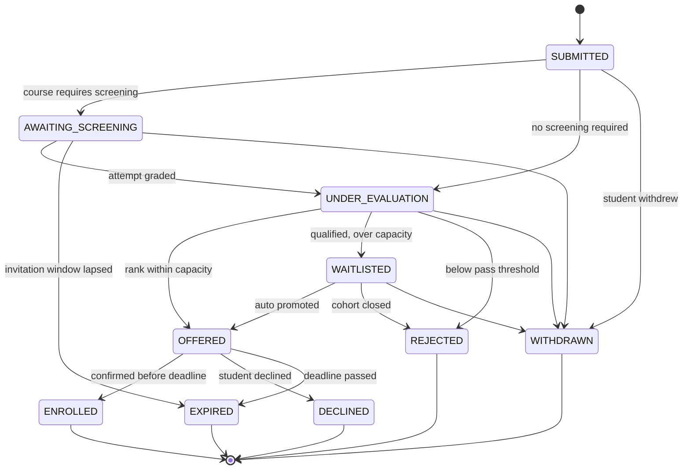
```mermaid
stateDiagram-v2
    [*] --> SUBMITTED
    SUBMITTED --> AWAITING_SCREENING : course requires screening
    SUBMITTED --> UNDER_EVALUATION : no screening required
    AWAITING_SCREENING --> UNDER_EVALUATION : attempt graded
    AWAITING_SCREENING --> EXPIRED : invitation window lapsed
    UNDER_EVALUATION --> OFFERED : rank within capacity
    UNDER_EVALUATION --> WAITLISTED : qualified, over capacity
    UNDER_EVALUATION --> REJECTED : below pass threshold
    OFFERED --> ENROLLED : confirmed before deadline
    OFFERED --> DECLINED : student declined
    OFFERED --> EXPIRED : deadline passed
    WAITLISTED --> OFFERED : auto promoted
    WAITLISTED --> REJECTED : cohort closed
    SUBMITTED --> WITHDRAWN : student withdrew
    AWAITING_SCREENING --> WITHDRAWN
    UNDER_EVALUATION --> WITHDRAWN
    WAITLISTED --> WITHDRAWN
    ENROLLED --> [*]
    REJECTED --> [*]
    DECLINED --> [*]
    EXPIRED --> [*]
    WITHDRAWN --> [*]
```

### Enrollment
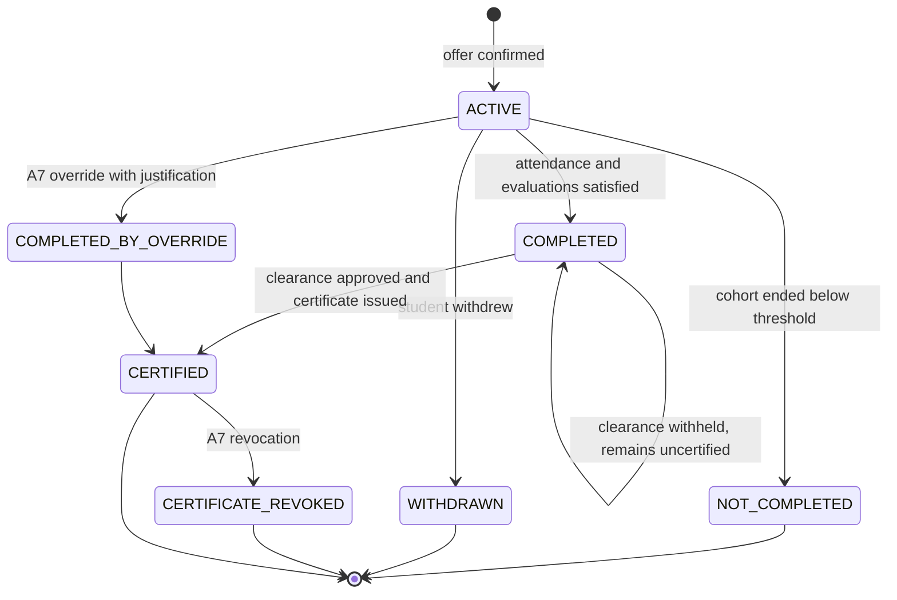
```mermaid
stateDiagram-v2
    [*] --> ACTIVE : offer confirmed
    ACTIVE --> COMPLETED : attendance and evaluations satisfied
    ACTIVE --> COMPLETED_BY_OVERRIDE : A7 override with justification
    ACTIVE --> NOT_COMPLETED : cohort ended below threshold
    ACTIVE --> WITHDRAWN : student withdrew
    COMPLETED --> CERTIFIED : clearance approved and certificate issued
    COMPLETED_BY_OVERRIDE --> CERTIFIED
    COMPLETED --> COMPLETED : clearance withheld, remains uncertified
    CERTIFIED --> CERTIFICATE_REVOKED : A7 revocation
    NOT_COMPLETED --> [*]
    WITHDRAWN --> [*]
    CERTIFICATE_REVOKED --> [*]
    CERTIFIED --> [*]
```

### Asset Unit
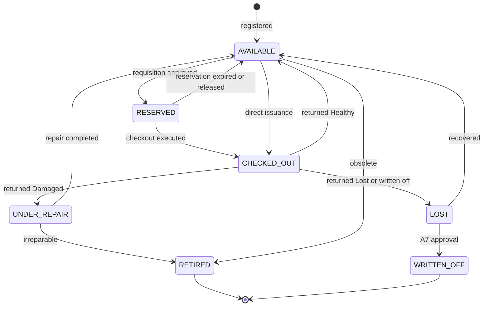
```mermaid
stateDiagram-v2
    [*] --> AVAILABLE : registered
    AVAILABLE --> RESERVED : requisition approved
    RESERVED --> AVAILABLE : reservation expired or released
    RESERVED --> CHECKED_OUT : checkout executed
    AVAILABLE --> CHECKED_OUT : direct issuance
    CHECKED_OUT --> AVAILABLE : returned Healthy
    CHECKED_OUT --> UNDER_REPAIR : returned Damaged
    CHECKED_OUT --> LOST : returned Lost or written off
    UNDER_REPAIR --> AVAILABLE : repair completed
    UNDER_REPAIR --> RETIRED : irreparable
    LOST --> AVAILABLE : recovered
    LOST --> WRITTEN_OFF : A7 approval
    AVAILABLE --> RETIRED : obsolete
    RETIRED --> [*]
    WRITTEN_OFF --> [*]
```

### Checkout Line
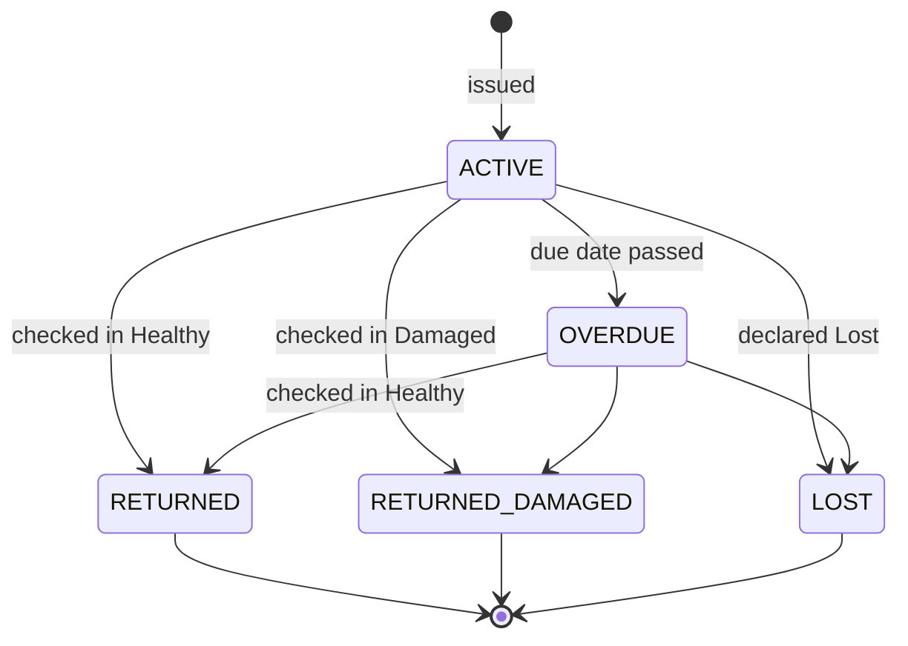
```mermaid
stateDiagram-v2
    [*] --> ACTIVE : issued
    ACTIVE --> OVERDUE : due date passed
    ACTIVE --> RETURNED : checked in Healthy
    OVERDUE --> RETURNED : checked in Healthy
    ACTIVE --> RETURNED_DAMAGED : checked in Damaged
    OVERDUE --> RETURNED_DAMAGED
    ACTIVE --> LOST : declared Lost
    OVERDUE --> LOST
    RETURNED --> [*]
    RETURNED_DAMAGED --> [*]
    LOST --> [*]
```

### Liability Record
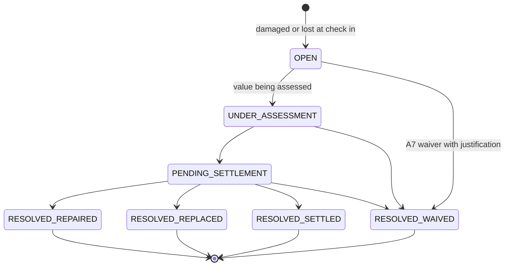
```mermaid
stateDiagram-v2
    [*] --> OPEN : damaged or lost at check in
    OPEN --> UNDER_ASSESSMENT : value being assessed
    UNDER_ASSESSMENT --> PENDING_SETTLEMENT
    PENDING_SETTLEMENT --> RESOLVED_REPAIRED
    PENDING_SETTLEMENT --> RESOLVED_REPLACED
    PENDING_SETTLEMENT --> RESOLVED_SETTLED
    OPEN --> RESOLVED_WAIVED : A7 waiver with justification
    UNDER_ASSESSMENT --> RESOLVED_WAIVED
    PENDING_SETTLEMENT --> RESOLVED_WAIVED
    RESOLVED_REPAIRED --> [*]
    RESOLVED_REPLACED --> [*]
    RESOLVED_SETTLED --> [*]
    RESOLVED_WAIVED --> [*]
```

### Clearance Record
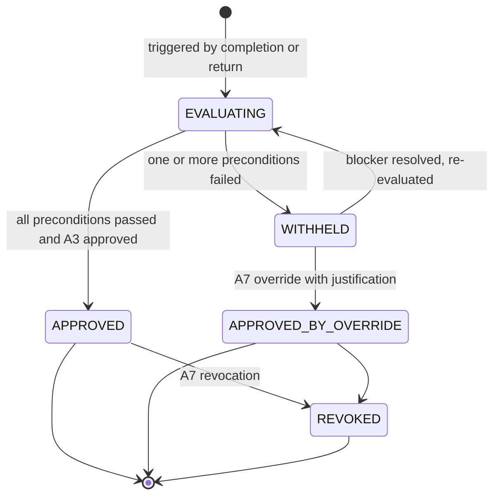
```mermaid
stateDiagram-v2
    [*] --> EVALUATING : triggered by completion or return
    EVALUATING --> WITHHELD : one or more preconditions failed
    WITHHELD --> EVALUATING : blocker resolved, re-evaluated
    EVALUATING --> APPROVED : all preconditions passed and A3 approved
    WITHHELD --> APPROVED_BY_OVERRIDE : A7 override with justification
    APPROVED --> REVOKED : A7 revocation
    APPROVED_BY_OVERRIDE --> REVOKED
    APPROVED --> [*]
    APPROVED_BY_OVERRIDE --> [*]
    REVOKED --> [*]
```

### Certificate
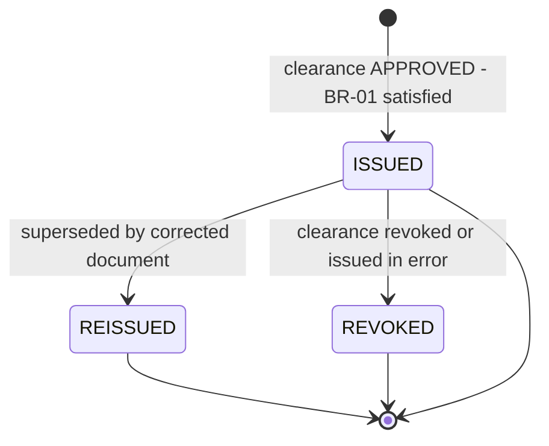
```mermaid
stateDiagram-v2
    [*] --> ISSUED : clearance APPROVED - BR-01 satisfied
    ISSUED --> REVOKED : clearance revoked or issued in error
    ISSUED --> REISSUED : superseded by corrected document
    REISSUED --> [*]
    REVOKED --> [*]
    ISSUED --> [*]
```

### Consultation Request
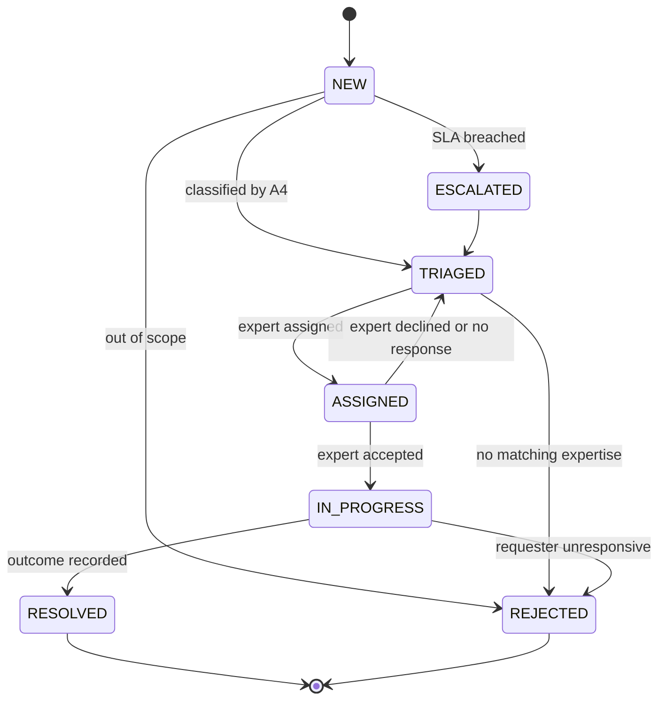
```mermaid
stateDiagram-v2
    [*] --> NEW
    NEW --> TRIAGED : classified by A4
    NEW --> REJECTED : out of scope
    NEW --> ESCALATED : SLA breached
    ESCALATED --> TRIAGED
    TRIAGED --> ASSIGNED : expert assigned
    TRIAGED --> REJECTED : no matching expertise
    ASSIGNED --> TRIAGED : expert declined or no response
    ASSIGNED --> IN_PROGRESS : expert accepted
    IN_PROGRESS --> RESOLVED : outcome recorded
    IN_PROGRESS --> REJECTED : requester unresponsive
    RESOLVED --> [*]
    REJECTED --> [*]
```

---

# PART C — Step 3: Enterprise Data Model (3NF ERD)

## C.1 Modelling Conventions

| Convention | Rule |
|---|---|
| Surrogate key | Every entity has `id uuid PK`. Natural keys are enforced as separate UNIQUE constraints, never as the PK. |
| Audit columns | `created_at timestamptz`, `updated_at timestamptz` on every mutable entity. `created_by` / `updated_by` on entities with editorial or approval semantics. |
| Soft delete | Not used. Lifecycle is expressed by explicit status enums so state transitions remain auditable. |
| Enumerations | Modelled as constrained enum types. Reference lists that the club will *edit at runtime* (rejection reasons, expertise domains, technologies, categories) are modelled as tables, not enums. |
| Derived values | **Never stored** unless the value is an authored decision snapshot. Attendance percentage, event attendance rate, stock availability and expert load are database **views**, listed in §C.12. |
| Money | `numeric(12,2)` with a separate `currency char(3)`. |
| Time | All timestamps `timestamptz`, stored UTC. |
| Multilingual | Short display fields carry `_ar` / `_en` variants. Long-form content (articles) uses a row-per-locale pattern with `translation_group_id`. |

## C.2 Master Relationship Map (entities only, no attributes)

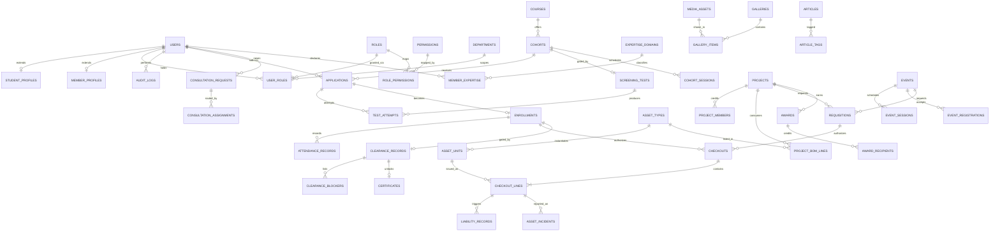
```mermaid
erDiagram
    USERS ||--o| STUDENT_PROFILES : extends
    USERS ||--o| MEMBER_PROFILES : extends
    USERS ||--o{ USER_ROLES : holds
    ROLES ||--o{ USER_ROLES : granted_via
    ROLES ||--o{ ROLE_PERMISSIONS : maps
    PERMISSIONS ||--o{ ROLE_PERMISSIONS : mapped_by
    DEPARTMENTS ||--o{ USER_ROLES : scopes
    USERS ||--o{ AUDIT_LOGS : performs

    COURSES ||--o{ COHORTS : offers
    COHORTS ||--o{ APPLICATIONS : receives
    USERS ||--o{ APPLICATIONS : submits
    COHORTS ||--o| SCREENING_TESTS : gated_by
    SCREENING_TESTS ||--o{ TEST_ATTEMPTS : produces
    APPLICATIONS ||--o{ TEST_ATTEMPTS : attempts
    APPLICATIONS ||--o| ENROLLMENTS : becomes
    COHORTS ||--o{ COHORT_SESSIONS : schedules
    ENROLLMENTS ||--o{ ATTENDANCE_RECORDS : records

    ENROLLMENTS ||--o{ CHECKOUTS : authorizes
    REQUISITIONS ||--o{ CHECKOUTS : authorizes
    CHECKOUTS ||--|{ CHECKOUT_LINES : contains
    ASSET_TYPES ||--o{ ASSET_UNITS : instantiates
    ASSET_UNITS ||--o{ CHECKOUT_LINES : issued_as
    CHECKOUT_LINES ||--o{ LIABILITY_RECORDS : triggers
    CHECKOUT_LINES ||--o{ ASSET_INCIDENTS : reported_on

    ENROLLMENTS ||--o| CLEARANCE_RECORDS : gated_by
    CLEARANCE_RECORDS ||--o{ CLEARANCE_BLOCKERS : lists
    CLEARANCE_RECORDS ||--o| CERTIFICATES : unlocks

    USERS ||--o{ CONSULTATION_REQUESTS : raises
    CONSULTATION_REQUESTS ||--o{ CONSULTATION_ASSIGNMENTS : routed_by
    USERS ||--o{ MEMBER_EXPERTISE : declares
    EXPERTISE_DOMAINS ||--o{ MEMBER_EXPERTISE : classifies

    PROJECTS ||--o{ PROJECT_MEMBERS : credits
    PROJECTS ||--o{ PROJECT_BOM_LINES : consumes
    ASSET_TYPES ||--o{ PROJECT_BOM_LINES : listed_in
    PROJECTS ||--o{ REQUISITIONS : requests

    EVENTS ||--o{ EVENT_SESSIONS : schedules
    EVENTS ||--o{ EVENT_REGISTRATIONS : accepts
    EVENTS ||--o{ REQUISITIONS : requests

    MEDIA_ASSETS ||--o{ GALLERY_ITEMS : shown_in
    GALLERIES ||--o{ GALLERY_ITEMS : contains
    ARTICLES ||--o{ ARTICLE_TAGS : tagged
    AWARDS ||--o{ AWARD_RECIPIENTS : credits
    PROJECTS ||--o{ AWARDS : earns
```

## C.3 Module M10 — Identity, RBAC, Audit & Notifications

```mermaid
erDiagram
    UNIVERSITIES ||--o{ STUDENT_PROFILES : "is attended by"
    USERS ||--o| STUDENT_PROFILES : "extended by"
    USERS ||--o| MEMBER_PROFILES : "extended by"
    DEPARTMENTS ||--o{ MEMBER_PROFILES : "primary home of"
    DEPARTMENTS ||--o| USERS : "led by"
    USERS ||--o{ USER_ROLES : "is granted"
    ROLES ||--o{ USER_ROLES : "granted through"
    DEPARTMENTS ||--o{ USER_ROLES : "scopes"
    ROLES ||--o{ ROLE_PERMISSIONS : "includes"
    PERMISSIONS ||--o{ ROLE_PERMISSIONS : "included in"
    USERS ||--o{ AUDIT_LOGS : "performed"
    USERS ||--o{ NOTIFICATIONS : "receives"
    NOTIFICATION_TEMPLATES ||--o{ NOTIFICATIONS : "renders"

    USERS {
        uuid id PK
        varchar email "UNIQUE citext"
        varchar phone "nullable"
        varchar password_hash
        varchar full_name_ar
        varchar full_name_en
        enum user_type "EXTERNAL_STUDENT MEMBER"
        enum status "PENDING_VERIFICATION ACTIVE SUSPENDED DEACTIVATED"
        char locale "ar or en"
        timestamptz email_verified_at "nullable"
        timestamptz last_login_at "nullable"
        int token_epoch "bumped to invalidate sessions"
        timestamptz created_at
        timestamptz updated_at
    }

    STUDENT_PROFILES {
        uuid user_id PK "also FK to USERS - 1:1"
        uuid university_id FK
        varchar faculty
        varchar department_name
        smallint academic_year
        varchar student_number "UNIQUE per university"
        timestamptz updated_at
    }

    MEMBER_PROFILES {
        uuid user_id PK "also FK to USERS - 1:1"
        uuid primary_department_id FK
        date joined_on
        text bio_ar
        text bio_en
        enum membership_status "ACTIVE ON_LEAVE ALUMNI"
        timestamptz updated_at
    }

    UNIVERSITIES {
        uuid id PK
        varchar name_ar "UNIQUE"
        varchar name_en
        varchar country_code
        timestamptz created_at
    }

    DEPARTMENTS {
        uuid id PK
        varchar code "UNIQUE - TRAINING LOGISTICS PROJECTS EVENTS MEDIA ADMIN"
        varchar name_ar
        varchar name_en
        text mandate
        uuid lead_user_id FK "nullable"
        timestamptz created_at
    }

    ROLES {
        uuid id PK
        varchar code "UNIQUE"
        varchar name_ar
        varchar name_en
        text description
        bool is_system "system roles cannot be deleted"
        timestamptz created_at
    }

    PERMISSIONS {
        uuid id PK
        varchar code "UNIQUE - module.action format"
        varchar module "M1 to M10"
        enum action "CREATE READ UPDATE DELETE APPROVE OVERRIDE EXPORT"
        text description
    }

    ROLE_PERMISSIONS {
        uuid role_id PK "composite PK with permission_id, FK"
        uuid permission_id PK "composite PK with role_id, FK"
        timestamptz granted_at
        uuid granted_by FK
    }

    USER_ROLES {
        uuid id PK
        uuid user_id FK
        uuid role_id FK
        uuid department_id FK "nullable - scopes role to a department"
        uuid assigned_by FK
        timestamptz assigned_at
        timestamptz expires_at "nullable"
        timestamptz revoked_at "nullable"
        uuid revoked_by FK "nullable"
    }

    AUDIT_LOGS {
        uuid id PK
        uuid actor_user_id FK "nullable for system actor"
        varchar action
        varchar entity_type
        uuid entity_id
        jsonb before_state
        jsonb after_state
        bool is_override
        text justification "required when is_override"
        inet ip_address
        varchar user_agent
        timestamptz created_at
    }

    SYSTEM_POLICIES {
        uuid id PK
        varchar key "UNIQUE"
        jsonb value
        text description
        uuid updated_by FK
        timestamptz updated_at
    }

    NOTIFICATION_TEMPLATES {
        uuid id PK
        varchar code "UNIQUE with locale"
        char locale
        enum channel "EMAIL IN_APP"
        varchar subject
        text body
        jsonb declared_variables
        timestamptz updated_at
    }

    NOTIFICATIONS {
        uuid id PK
        uuid recipient_user_id FK
        uuid template_id FK
        jsonb payload
        enum channel "EMAIL IN_APP"
        enum status "QUEUED SENT FAILED"
        timestamptz sent_at
        timestamptz read_at
        timestamptz created_at
    }
```

## C.4 Module M3 — Courses, Cohorts, Applications & Enrollment

```mermaid
erDiagram
    COURSES ||--o{ COURSE_MODULES : "structured into"
    COURSE_MODULES ||--o{ COURSE_MODULE_MATERIALS : "attaches"
    COURSES ||--o{ COHORTS : "delivered as"
    COURSES ||--o| KIT_TEMPLATES : "requires"
    COHORTS ||--o{ COHORT_SESSIONS : "scheduled as"
    COHORTS ||--o{ APPLICATIONS : "receives"
    USERS ||--o{ APPLICATIONS : "submits"
    APPLICATIONS ||--o{ APPLICATION_STATUS_HISTORY : "transitions"
    REJECTION_REASONS ||--o{ APPLICATIONS : "explains"
    APPLICATIONS ||--o| ENROLLMENTS : "converts to"
    ENROLLMENTS ||--o{ ATTENDANCE_RECORDS : "attended via"
    COHORT_SESSIONS ||--o{ ATTENDANCE_RECORDS : "recorded for"

    COURSES {
        uuid id PK
        varchar code "UNIQUE"
        varchar title_ar
        varchar title_en
        varchar track "ARDUINO PCB PRINTING_3D AI VIBE_CODING OTHER"
        enum level "BEGINNER INTERMEDIATE ADVANCED"
        text description_ar
        text description_en
        text learning_outcomes
        text prerequisites_text
        smallint session_count
        smallint duration_hours
        char language
        bool requires_screening "D-07"
        uuid kit_template_id FK "nullable"
        enum status "DRAFT PUBLISHED ARCHIVED"
        uuid created_by FK
        timestamptz created_at
        timestamptz updated_at
    }

    COURSE_MODULES {
        uuid id PK
        uuid course_id FK
        smallint order_index "UNIQUE with course_id"
        varchar title
        text objectives
        smallint estimated_minutes
        enum visibility "PUBLIC ENROLLED INTERNAL"
    }

    COURSE_MODULE_MATERIALS {
        uuid id PK
        uuid course_module_id FK
        uuid media_asset_id FK
        varchar title
        enum visibility "ENROLLED INTERNAL"
        smallint order_index
    }

    COHORTS {
        uuid id PK
        uuid course_id FK
        varchar code "UNIQUE"
        smallint capacity
        smallint waitlist_capacity
        timestamptz application_opens_at
        timestamptz application_closes_at
        date starts_on
        date ends_on
        smallint offer_confirmation_hours "BR-04"
        smallint min_attendance_pct "BR-05"
        enum status "DRAFT OPEN CLOSED RUNNING FINISHED CANCELLED"
        uuid created_by FK
        timestamptz created_at
    }

    COHORT_SESSIONS {
        uuid id PK
        uuid cohort_id FK
        smallint session_no "UNIQUE with cohort_id"
        uuid course_module_id FK "nullable"
        timestamptz scheduled_at
        smallint duration_minutes
        varchar location
        enum status "PLANNED HELD CANCELLED"
    }

    APPLICATIONS {
        uuid id PK
        uuid cohort_id FK "UNIQUE with applicant_user_id"
        uuid applicant_user_id FK
        enum status "SUBMITTED AWAITING_SCREENING UNDER_EVALUATION OFFERED WAITLISTED ENROLLED REJECTED DECLINED EXPIRED WITHDRAWN"
        jsonb background_snapshot "immutable copy at submission"
        numeric readiness_score "nullable - authored snapshot"
        smallint rank_position "nullable"
        smallint waitlist_rank "nullable"
        timestamptz offer_issued_at
        timestamptz offer_expires_at
        timestamptz decided_at
        uuid decided_by FK "nullable"
        uuid rejection_reason_id FK "nullable"
        timestamptz submitted_at
        timestamptz updated_at
    }

    APPLICATION_STATUS_HISTORY {
        uuid id PK
        uuid application_id FK
        varchar from_status
        varchar to_status
        uuid changed_by FK "nullable for system"
        text reason
        timestamptz changed_at
    }

    REJECTION_REASONS {
        uuid id PK
        varchar code "UNIQUE"
        varchar text_ar
        varchar text_en
        bool is_active
    }

    ENROLLMENTS {
        uuid id PK
        uuid application_id FK "UNIQUE - 1:1"
        uuid cohort_id FK
        uuid student_user_id FK
        enum status "ACTIVE COMPLETED COMPLETED_BY_OVERRIDE NOT_COMPLETED WITHDRAWN CERTIFIED CERTIFICATE_REVOKED"
        timestamptz enrolled_at
        timestamptz completed_at "nullable"
        uuid completion_marked_by FK "nullable"
        bool completion_overridden
        text completion_override_reason
        timestamptz updated_at
    }

    ATTENDANCE_RECORDS {
        uuid id PK
        uuid enrollment_id FK "UNIQUE with cohort_session_id"
        uuid cohort_session_id FK
        enum state "PRESENT ABSENT EXCUSED LATE"
        uuid recorded_by FK
        timestamptz recorded_at
        text note
        timestamptz amended_at "nullable"
        text amendment_reason
    }
```

## C.5 Module M4 — Screening, Assessment & Scoring

```mermaid
erDiagram
    TOPICS ||--o{ QUESTION_TOPICS : "classifies"
    QUESTIONS ||--o{ QUESTION_TOPICS : "classified by"
    QUESTIONS ||--o{ QUESTION_OPTIONS : "offers"
    COHORTS ||--o| SCREENING_TESTS : "gated by"
    SCREENING_TESTS ||--o{ TEST_QUESTIONS : "composed of"
    QUESTIONS ||--o{ TEST_QUESTIONS : "used in"
    SCREENING_TESTS ||--o{ TEST_ATTEMPTS : "attempted as"
    APPLICATIONS ||--o{ TEST_ATTEMPTS : "generates"
    TEST_ATTEMPTS ||--o{ ATTEMPT_ANSWERS : "contains"
    QUESTIONS ||--o{ ATTEMPT_ANSWERS : "answered in"
    QUESTION_OPTIONS ||--o{ ATTEMPT_ANSWERS : "selected as"
    COHORTS ||--o{ READINESS_MODELS : "scored by"
    READINESS_MODELS ||--|{ READINESS_FACTORS : "weighted by"
    READINESS_FACTORS ||--o{ APPLICATION_SCORE_FACTORS : "evaluated as"
    APPLICATIONS ||--o{ APPLICATION_SCORE_FACTORS : "broken down into"

    TOPICS {
        uuid id PK
        varchar code "UNIQUE"
        varchar name_ar
        varchar name_en
    }

    QUESTIONS {
        uuid id PK
        uuid root_question_id FK "nullable - links versions of same question"
        smallint version
        bool is_current
        enum type "SINGLE_CHOICE MULTI_CHOICE TRUE_FALSE NUMERIC SHORT_ANSWER CODE"
        text stem
        enum difficulty "EASY MEDIUM HARD"
        numeric max_score
        bool auto_gradable
        text grading_rubric "nullable - for manual items"
        uuid created_by FK
        timestamptz created_at
    }

    QUESTION_OPTIONS {
        uuid id PK
        uuid question_id FK
        smallint order_index "UNIQUE with question_id"
        text option_text
        bool is_correct
    }

    QUESTION_TOPICS {
        uuid question_id PK "composite PK, FK"
        uuid topic_id PK "composite PK, FK"
    }

    SCREENING_TESTS {
        uuid id PK
        uuid cohort_id FK "UNIQUE - one active test per cohort"
        varchar title
        smallint version
        smallint duration_minutes
        smallint attempt_limit
        numeric max_score
        numeric pass_threshold "BR-02"
        bool shuffle_questions
        bool shuffle_options
        enum result_visibility "HIDDEN SCORE_ONLY SCORE_AND_FEEDBACK FULL"
        enum status "DRAFT ACTIVE LOCKED ARCHIVED"
        uuid created_by FK
        timestamptz created_at
    }

    TEST_QUESTIONS {
        uuid screening_test_id PK "composite PK, FK"
        uuid question_id PK "composite PK, FK"
        smallint question_version "frozen version reference"
        smallint order_index
        numeric weight
    }

    TEST_ATTEMPTS {
        uuid id PK
        uuid screening_test_id FK
        uuid application_id FK "UNIQUE with attempt_no"
        smallint attempt_no
        timestamptz started_at
        timestamptz deadline_at "server authoritative"
        timestamptz submitted_at "nullable"
        bool auto_submitted
        numeric raw_score "nullable"
        numeric normalized_score "nullable"
        enum state "IN_PROGRESS SUBMITTED GRADING GRADED VOIDED"
    }

    ATTEMPT_ANSWERS {
        uuid id PK
        uuid test_attempt_id FK "UNIQUE with question_id"
        uuid question_id FK
        uuid selected_option_id FK "nullable - single choice"
        jsonb answer_payload "multi choice, numeric, text, code"
        numeric auto_score "nullable"
        numeric awarded_score "nullable"
        uuid graded_by FK "nullable"
        timestamptz graded_at "nullable"
        text grader_comment
        bool is_override
        numeric original_score "nullable - preserved on override"
        text override_reason
    }

    READINESS_MODELS {
        uuid id PK
        uuid cohort_id FK
        varchar name
        bool is_active "one active per cohort"
        uuid created_by FK
        timestamptz created_at
    }

    READINESS_FACTORS {
        uuid id PK
        uuid readiness_model_id FK
        varchar factor_code "UNIQUE with model - TEST_SCORE ACADEMIC_YEAR PRIOR_EXPERIENCE MOTIVATION"
        smallint weight_pct "model total must equal 100"
        enum value_source "TEST DECLARED MANUAL"
    }

    APPLICATION_SCORE_FACTORS {
        uuid application_id PK "composite PK, FK"
        uuid readiness_factor_id PK "composite PK, FK"
        numeric raw_value
        numeric weighted_value
        timestamptz computed_at
    }
```

## C.6 Module M5 — Hardware Inventory, Requisition & Custody

```mermaid
erDiagram
    ASSET_CATEGORIES ||--o{ ASSET_TYPES : "classifies"
    ASSET_TYPES ||--o{ ASSET_UNITS : "instantiated as"
    ASSET_TYPES ||--o{ BULK_STOCK : "counted as"
    STORAGE_LOCATIONS ||--o{ ASSET_UNITS : "stores"
    STORAGE_LOCATIONS ||--o{ BULK_STOCK : "holds"
    STORAGE_LOCATIONS ||--o{ STORAGE_LOCATIONS : "contains"
    KIT_TEMPLATES ||--|{ KIT_TEMPLATE_ITEMS : "composed of"
    ASSET_TYPES ||--o{ KIT_TEMPLATE_ITEMS : "included in"
    USERS ||--o{ REQUISITIONS : "raises"
    REQUISITIONS ||--|{ REQUISITION_LINES : "contains"
    ASSET_TYPES ||--o{ REQUISITION_LINES : "requested as"
    REQUISITION_LINES ||--o{ STOCK_RESERVATIONS : "reserves"
    REQUISITIONS ||--o{ CHECKOUTS : "authorizes"
    ENROLLMENTS ||--o{ CHECKOUTS : "authorizes"
    USERS ||--o{ CHECKOUTS : "holds custody"
    CHECKOUTS ||--|{ CHECKOUT_LINES : "contains"
    ASSET_UNITS ||--o{ CHECKOUT_LINES : "issued as"
    ASSET_TYPES ||--o{ CHECKOUT_LINES : "issued as bulk"
    CHECKOUT_LINES ||--o{ ASSET_INCIDENTS : "reported against"
    CHECKOUT_LINES ||--o| LIABILITY_RECORDS : "triggers"

    ASSET_CATEGORIES {
        uuid id PK
        varchar code "UNIQUE - MICROCONTROLLER SENSOR ACTUATOR TOOL PRINTER_3D CONSUMABLE OTHER"
        varchar name_ar
        varchar name_en
    }

    ASSET_TYPES {
        uuid id PK
        uuid asset_category_id FK
        varchar name
        varchar manufacturer
        varchar model "UNIQUE with manufacturer"
        jsonb specifications
        varchar datasheet_url
        enum unit_of_measure "PIECE METER GRAM SET"
        enum tracking_mode "SERIALIZED BULK"
        bool is_consumable "excluded from return obligation"
        smallint low_stock_threshold
        numeric unit_cost
        char currency
        timestamptz created_at
    }

    STORAGE_LOCATIONS {
        uuid id PK
        varchar code "UNIQUE"
        varchar name
        uuid parent_location_id FK "nullable - hierarchical"
        text description
    }

    ASSET_UNITS {
        uuid id PK
        uuid asset_type_id FK
        varchar asset_tag "UNIQUE"
        date acquisition_date
        varchar acquisition_source
        varchar cost_center
        uuid current_location_id FK
        enum condition "HEALTHY DAMAGED LOST"
        enum status "AVAILABLE RESERVED CHECKED_OUT UNDER_REPAIR LOST RETIRED WRITTEN_OFF"
        timestamptz retired_at "nullable"
        text retire_reason
        timestamptz created_at
    }

    BULK_STOCK {
        uuid id PK
        uuid asset_type_id FK "UNIQUE with location_id"
        uuid storage_location_id FK
        int quantity_on_hand
        int quantity_reserved
        timestamptz updated_at
    }

    KIT_TEMPLATES {
        uuid id PK
        varchar code "UNIQUE"
        varchar name
        text description
        timestamptz created_at
    }

    KIT_TEMPLATE_ITEMS {
        uuid kit_template_id PK "composite PK, FK"
        uuid asset_type_id PK "composite PK, FK"
        int quantity
    }

    REQUISITIONS {
        uuid id PK
        varchar requisition_no "UNIQUE"
        uuid requester_user_id FK
        enum purpose_type "COHORT PROJECT EVENT"
        uuid cohort_id FK "nullable - exactly one context set"
        uuid project_id FK "nullable"
        uuid event_id FK "nullable"
        date required_by
        enum status "PENDING APPROVED PARTIALLY_APPROVED REJECTED FULFILLED CANCELLED"
        uuid reviewed_by FK "nullable"
        timestamptz reviewed_at
        text review_reason
        timestamptz created_at
    }

    REQUISITION_LINES {
        uuid id PK
        uuid requisition_id FK "UNIQUE with asset_type_id"
        uuid asset_type_id FK
        int quantity_requested
        int quantity_approved
    }

    STOCK_RESERVATIONS {
        uuid id PK
        uuid requisition_line_id FK
        uuid asset_type_id FK
        uuid storage_location_id FK
        int quantity
        timestamptz expires_at
        enum status "ACTIVE CONSUMED EXPIRED RELEASED"
        timestamptz created_at
    }

    CHECKOUTS {
        uuid id PK
        varchar checkout_no "UNIQUE"
        enum custody_type "STUDENT PROJECT_TEAM EVENT_LEAD"
        uuid holder_user_id FK "single accountable party - D-05"
        uuid enrollment_id FK "nullable - required when custody_type STUDENT"
        uuid requisition_id FK "nullable - required for team or event"
        uuid issued_by FK
        timestamptz issued_at
        timestamptz due_at
        timestamptz acknowledged_at "nullable"
        enum status "ACTIVE PARTIALLY_RETURNED CLOSED"
        bool issued_under_override
        text override_justification
    }

    CHECKOUT_LINES {
        uuid id PK
        uuid checkout_id FK
        uuid asset_type_id FK
        uuid asset_unit_id FK "nullable - null for BULK tracking"
        int quantity "1 for serialized"
        enum condition_at_issue "HEALTHY DAMAGED"
        enum status "ACTIVE OVERDUE RETURNED RETURNED_DAMAGED LOST"
        timestamptz returned_at "nullable"
        uuid received_by FK "nullable"
        enum condition_at_return "HEALTHY DAMAGED LOST - null while ACTIVE"
        text inspection_notes
        uuid evidence_media_id FK "nullable"
    }

    ASSET_INCIDENTS {
        uuid id PK
        uuid checkout_line_id FK
        uuid reported_by FK
        text description
        uuid evidence_media_id FK "nullable"
        enum status "OPEN ACKNOWLEDGED RESOLVED DISMISSED"
        timestamptz reported_at
        timestamptz resolved_at "nullable"
        uuid resolved_by FK "nullable"
    }

    LIABILITY_RECORDS {
        uuid id PK
        uuid checkout_line_id FK "UNIQUE - one liability per line"
        uuid holder_user_id FK
        uuid enrollment_id FK "nullable - null for team or event custody"
        enum liability_type "DAMAGE LOSS"
        numeric assessed_value
        char currency
        enum status "OPEN UNDER_ASSESSMENT PENDING_SETTLEMENT RESOLVED_REPAIRED RESOLVED_REPLACED RESOLVED_SETTLED RESOLVED_WAIVED"
        text resolution_note
        uuid replacement_asset_unit_id FK "nullable"
        uuid resolved_by FK "nullable"
        timestamptz resolved_at "nullable"
        uuid waived_by FK "nullable - A7 only"
        text waiver_justification
        timestamptz created_at
    }
```

## C.7 Module M6 — Clearance & Certification *(the BR-01 structure)*

```mermaid
erDiagram
    ENROLLMENTS ||--o| CLEARANCE_RECORDS : "gated by 1:1"
    CLEARANCE_RECORDS ||--o{ CLEARANCE_BLOCKERS : "itemizes"
    CLEARANCE_RECORDS ||--o| CERTIFICATES : "unlocks 1:1"
    ENROLLMENTS ||--o| CERTIFICATES : "attests to 1:1"
    USERS ||--o{ CLEARANCE_RECORDS : "approves"
    MEDIA_ASSETS ||--o{ CERTIFICATES : "stores document"
    CERTIFICATES ||--o{ CERTIFICATE_VERIFICATIONS : "verified by"

    CLEARANCE_RECORDS {
        uuid id PK
        uuid enrollment_id FK "UNIQUE - enforces D-03 per enrollment scope"
        enum status "EVALUATING WITHHELD APPROVED APPROVED_BY_OVERRIDE REVOKED"
        jsonb precondition_snapshot "C1 to C5 results at decision time"
        bool advisory_outstanding_elsewhere "BR-13 advisory, non blocking"
        uuid approved_by FK "nullable"
        timestamptz approved_at "nullable"
        uuid withheld_by FK "nullable"
        timestamptz withheld_at "nullable"
        bool is_override
        text override_justification "required when is_override"
        uuid revoked_by FK "nullable"
        timestamptz revoked_at "nullable"
        text revoke_reason
        timestamptz created_at
        timestamptz updated_at
    }

    CLEARANCE_BLOCKERS {
        uuid id PK
        uuid clearance_record_id FK
        enum blocker_code "NOT_COMPLETED ITEMS_OUTSTANDING INSPECTION_PENDING LIABILITY_OPEN INCIDENT_OPEN"
        varchar reference_entity "checkout_lines liability_records asset_incidents"
        uuid reference_id
        text detail_ar
        text detail_en
        timestamptz raised_at
        timestamptz resolved_at "nullable"
    }

    CERTIFICATES {
        uuid id PK
        uuid enrollment_id FK "UNIQUE - one certificate per enrollment"
        uuid clearance_record_id FK "UNIQUE and NOT NULL - BR-01 hard gate"
        varchar serial_no "UNIQUE"
        varchar verification_code "UNIQUE - 128 bit random, BR-10"
        uuid document_media_id FK
        timestamptz issued_at
        uuid issued_by FK "nullable for system issuance"
        bool issued_under_override "propagated from clearance"
        enum status "ISSUED REVOKED REISSUED"
        uuid supersedes_certificate_id FK "nullable"
        timestamptz revoked_at "nullable"
        uuid revoked_by FK "nullable"
        text revoke_reason
    }

    CERTIFICATE_VERIFICATIONS {
        uuid id PK
        uuid certificate_id FK
        timestamptz verified_at
        varchar source_fingerprint "hashed, no PII retained"
    }
```

> **The lock, expressed structurally:** `certificates.clearance_record_id` is **NOT NULL** and **UNIQUE**, with a foreign key to `clearance_records`. A certificate row therefore cannot physically exist without a clearance row. The additional CHECK in §C.11 (`CK_CERT_CLEARANCE_APPROVED`) closes the remaining gap — that the referenced clearance is in an approved state. Together these mean BR-01 holds even if every line of application code is wrong.

## C.8 Module M2 — Graduation Project Consultation Gateway

```mermaid
erDiagram
    EXPERTISE_DOMAINS ||--o{ MEMBER_EXPERTISE : "classifies"
    USERS ||--o{ MEMBER_EXPERTISE : "declares"
    PROJECTS ||--o{ MEMBER_EXPERTISE : "evidences"
    USERS ||--o{ CONSULTATION_REQUESTS : "raises"
    UNIVERSITIES ||--o{ CONSULTATION_REQUESTS : "originates from"
    CONSULTATION_REQUESTS ||--o{ CONSULTATION_REQUEST_DOMAINS : "classified as"
    EXPERTISE_DOMAINS ||--o{ CONSULTATION_REQUEST_DOMAINS : "classifies"
    CONSULTATION_REQUESTS ||--o{ CONSULTATION_ASSIGNMENTS : "routed via"
    USERS ||--o{ CONSULTATION_ASSIGNMENTS : "assigned to"
    CONSULTATION_REQUESTS ||--o{ CONSULTATION_MESSAGES : "discussed in"
    CONSULTATION_MESSAGES ||--o{ CONSULTATION_ATTACHMENTS : "carries"
    MEDIA_ASSETS ||--o{ CONSULTATION_ATTACHMENTS : "attached as"

    EXPERTISE_DOMAINS {
        uuid id PK
        varchar code "UNIQUE"
        varchar name_ar
        varchar name_en
        bool is_active
    }

    MEMBER_EXPERTISE {
        uuid id PK
        uuid member_user_id FK "UNIQUE with domain_id"
        uuid expertise_domain_id FK
        enum proficiency "FAMILIAR PROFICIENT EXPERT"
        uuid evidence_project_id FK "nullable"
        bool is_available "member editable - D-06"
        smallint max_concurrent_load
        uuid curated_by FK "A4 curation - D-06"
        timestamptz created_at
    }

    CONSULTATION_REQUESTS {
        uuid id PK
        varchar reference_no "UNIQUE"
        uuid requester_user_id FK
        varchar title
        text abstract
        uuid university_id FK "nullable"
        varchar supervisor_name
        date project_deadline_on
        enum support_type "TECHNICAL_ADVICE COMPONENT_SELECTION CODE_REVIEW MENTORSHIP OTHER"
        enum status "NEW TRIAGED ASSIGNED IN_PROGRESS RESOLVED REJECTED ESCALATED"
        enum priority "LOW NORMAL HIGH"
        enum complexity "LOW MEDIUM HIGH"
        uuid triaged_by FK "nullable"
        timestamptz triaged_at "nullable"
        timestamptz sla_due_at "BR-08"
        bool sla_breached
        timestamptz closed_at "nullable"
        enum outcome_category "ADVICE_GIVEN ONGOING_MENTORSHIP OUT_OF_SCOPE UNRESPONSIVE"
        text outcome_summary
        smallint satisfaction_rating "nullable 1 to 5"
        text rejection_reason
        timestamptz created_at
    }

    CONSULTATION_REQUEST_DOMAINS {
        uuid consultation_request_id PK "composite PK, FK"
        uuid expertise_domain_id PK "composite PK, FK"
    }

    CONSULTATION_ASSIGNMENTS {
        uuid id PK
        uuid consultation_request_id FK
        uuid expert_user_id FK
        uuid assigned_by FK
        timestamptz assigned_at
        timestamptz response_due_at
        enum state "PENDING_ACCEPTANCE ACCEPTED DECLINED NO_RESPONSE RELEASED"
        text decline_reason
        timestamptz released_at "nullable"
    }

    CONSULTATION_MESSAGES {
        uuid id PK
        uuid consultation_request_id FK
        uuid sender_user_id FK
        text body
        timestamptz sent_at
        timestamptz read_at "nullable"
    }

    CONSULTATION_ATTACHMENTS {
        uuid consultation_message_id PK "composite PK, FK"
        uuid media_asset_id PK "composite PK, FK"
        varchar filename
    }
```

## C.9 Modules M7 & M8 — Projects Repository and Events

```mermaid
erDiagram
    PROJECTS ||--o{ PROJECT_MEMBERS : "credits"
    USERS ||--o{ PROJECT_MEMBERS : "contributes to"
    TECHNOLOGIES ||--o{ PROJECT_TECHNOLOGIES : "classifies"
    PROJECTS ||--o{ PROJECT_TECHNOLOGIES : "classified by"
    PROJECTS ||--o{ PROJECT_BOM_LINES : "consumes"
    ASSET_TYPES ||--o{ PROJECT_BOM_LINES : "listed in"
    PROJECTS ||--o{ PROJECT_MEDIA : "illustrated by"
    MEDIA_ASSETS ||--o{ PROJECT_MEDIA : "illustrates"
    VENUES ||--o{ EVENTS : "hosts"
    DEPARTMENTS ||--o{ EVENTS : "organizes"
    EVENTS ||--o{ EVENT_SESSIONS : "scheduled as"
    EVENTS ||--o{ EVENT_REGISTRATIONS : "accepts"
    USERS ||--o{ EVENT_REGISTRATIONS : "registers"

    PROJECTS {
        uuid id PK
        varchar code "UNIQUE"
        varchar title_ar
        varchar title_en
        text abstract
        text problem_statement
        enum status "IDEA IN_PROGRESS COMPLETED ARCHIVED"
        date start_on
        date end_on
        text outcome
        uuid cover_media_id FK "nullable"
        enum publication_status "DRAFT PENDING_REVIEW SCHEDULED PUBLISHED REJECTED"
        timestamptz scheduled_publish_at "nullable"
        timestamptz published_at "nullable"
        uuid published_by FK "nullable"
        uuid created_by FK
        timestamptz created_at
    }

    PROJECT_MEMBERS {
        uuid project_id PK "composite PK, FK"
        uuid user_id PK "composite PK, FK"
        enum role_in_project "LEAD HARDWARE FIRMWARE MECHANICAL ML DOCUMENTATION"
        text contribution_note
    }

    TECHNOLOGIES {
        uuid id PK
        varchar name "UNIQUE"
        varchar category
    }

    PROJECT_TECHNOLOGIES {
        uuid project_id PK "composite PK, FK"
        uuid technology_id PK "composite PK, FK"
    }

    PROJECT_BOM_LINES {
        uuid id PK
        uuid project_id FK "UNIQUE with asset_type_id"
        uuid asset_type_id FK
        int quantity
        text note
    }

    PROJECT_MEDIA {
        uuid project_id PK "composite PK, FK"
        uuid media_asset_id PK "composite PK, FK"
        varchar caption
        smallint order_index
        enum visibility "PUBLIC INTERNAL"
    }

    VENUES {
        uuid id PK
        varchar name "UNIQUE"
        smallint capacity
        text location_note
    }

    EVENTS {
        uuid id PK
        varchar code "UNIQUE"
        enum type "WORKSHOP EXHIBITION HACKATHON SEMINAR"
        varchar title_ar
        varchar title_en
        text description
        timestamptz starts_at
        timestamptz ends_at
        uuid venue_id FK "nullable"
        uuid organizing_department_id FK
        varchar target_audience
        smallint capacity
        smallint waitlist_capacity
        timestamptz registration_opens_at
        timestamptz registration_closes_at
        timestamptz cancellation_cutoff_at
        enum eligibility "PUBLIC REGISTERED_STUDENTS MEMBERS_ONLY"
        enum status "PLANNED RUNNING FINISHED CANCELLED POSTPONED"
        text cancel_reason
        enum publication_status "DRAFT PENDING_REVIEW SCHEDULED PUBLISHED"
        timestamptz published_at "nullable"
        uuid created_by FK
        timestamptz created_at
    }

    EVENT_SESSIONS {
        uuid id PK
        uuid event_id FK
        varchar title
        timestamptz starts_at
        timestamptz ends_at
        varchar room
        varchar track
        varchar speaker_name
        uuid speaker_user_id FK "nullable"
    }

    EVENT_REGISTRATIONS {
        uuid id PK
        uuid event_id FK "UNIQUE with attendee_user_id"
        uuid attendee_user_id FK "nullable for guest walk in"
        varchar guest_name "nullable"
        varchar guest_email "nullable"
        varchar attendance_token "UNIQUE"
        enum state "REGISTERED WAITLISTED CANCELLED ATTENDED NO_SHOW"
        smallint waitlist_rank "nullable"
        bool is_walk_in
        timestamptz registered_at
        timestamptz cancelled_at "nullable"
        timestamptz checked_in_at "nullable"
        uuid checked_in_by FK "nullable"
    }
```

## C.10 Module M9 — Media, News & Hall of Fame

```mermaid
erDiagram
    USERS ||--o{ MEDIA_ASSETS : "uploads"
    ARTICLE_CATEGORIES ||--o{ ARTICLES : "classifies"
    USERS ||--o{ ARTICLES : "authors"
    MEDIA_ASSETS ||--o{ ARTICLES : "covers"
    ARTICLES ||--o{ ARTICLE_TAGS : "tagged with"
    TAGS ||--o{ ARTICLE_TAGS : "tags"
    GALLERIES ||--|{ GALLERY_ITEMS : "contains"
    MEDIA_ASSETS ||--o{ GALLERY_ITEMS : "displayed in"
    EVENTS ||--o{ GALLERIES : "documented by"
    PROJECTS ||--o{ GALLERIES : "documented by"
    PROJECTS ||--o{ AWARDS : "earns"
    EVENTS ||--o{ AWARDS : "awarded at"
    AWARDS ||--o{ AWARD_RECIPIENTS : "credits"
    USERS ||--o{ AWARD_RECIPIENTS : "receives"

    MEDIA_ASSETS {
        uuid id PK
        varchar storage_key "UNIQUE"
        varchar mime_type
        bigint byte_size
        int width "nullable"
        int height "nullable"
        varchar caption
        varchar credit
        date captured_on "nullable"
        enum usage_rights "CLUB_OWNED LICENSED PUBLIC_DOMAIN RESTRICTED"
        uuid uploaded_by FK
        timestamptz created_at
    }

    ARTICLE_CATEGORIES {
        uuid id PK
        varchar code "UNIQUE"
        varchar name_ar
        varchar name_en
    }

    ARTICLES {
        uuid id PK
        varchar slug "UNIQUE with locale"
        char locale
        uuid translation_group_id "links ar and en variants"
        varchar title
        text summary
        text body
        uuid article_category_id FK
        uuid cover_media_id FK "nullable"
        uuid author_user_id FK
        enum publication_status "DRAFT PENDING_REVIEW SCHEDULED PUBLISHED REJECTED"
        timestamptz scheduled_publish_at "nullable"
        timestamptz published_at "nullable"
        uuid published_by FK "nullable"
        text review_comments
        timestamptz created_at
        timestamptz updated_at
    }

    TAGS {
        uuid id PK
        varchar name "UNIQUE"
    }

    ARTICLE_TAGS {
        uuid article_id PK "composite PK, FK"
        uuid tag_id PK "composite PK, FK"
    }

    GALLERIES {
        uuid id PK
        varchar title
        text description
        uuid event_id FK "nullable"
        uuid project_id FK "nullable"
        enum publication_status "DRAFT PENDING_REVIEW PUBLISHED"
        timestamptz published_at "nullable"
        uuid created_by FK
        timestamptz created_at
    }

    GALLERY_ITEMS {
        uuid gallery_id PK "composite PK, FK"
        uuid media_asset_id PK "composite PK, FK"
        smallint order_index
        varchar caption
    }

    AWARDS {
        uuid id PK
        varchar title
        varchar awarding_body
        varchar competition
        enum level "LOCAL NATIONAL INTERNATIONAL"
        varchar rank_place
        date awarded_on
        uuid project_id FK "nullable"
        uuid event_id FK "nullable"
        uuid evidence_media_id FK "nullable"
        enum publication_status "DRAFT PENDING_REVIEW PUBLISHED"
        timestamptz published_at "nullable"
        timestamptz created_at
    }

    AWARD_RECIPIENTS {
        uuid award_id PK "composite PK, FK"
        uuid user_id PK "composite PK, FK"
        varchar role_note
    }
```

## C.11 Constraint Catalogue — What the Diagrams Cannot Express

Mermaid ER notation cannot render CHECK constraints, partial indexes, or exclusion constraints. These are the constraints that actually enforce the business rules, listed here so nothing is lost between Step 3 and implementation.

| ID | Constraint | Table | Enforces |
|---|---|---|---|
| `UQ_CHECKOUT_ACTIVE_UNIT` | **Partial unique index** on `asset_unit_id` where `status IN ('ACTIVE','OVERDUE')` | `checkout_lines` | **BR-07** — one active custody per serialized unit |
| `CK_CERT_CLEARANCE_APPROVED` | `clearance_record_id` must reference a row with `status IN ('APPROVED','APPROVED_BY_OVERRIDE')` — enforced by trigger or by a composite FK on `(id, status)` | `certificates` | **BR-01** — the clearance lock |
| `UQ_CERT_ENROLLMENT` | UNIQUE on `enrollment_id` | `certificates` | One certificate per enrollment (D-03) |
| `UQ_CLEARANCE_ENROLLMENT` | UNIQUE on `enrollment_id` | `clearance_records` | 1:1 clearance scope (D-03) |
| `CK_CLEARANCE_OVERRIDE_JUSTIFIED` | `is_override = false OR override_justification IS NOT NULL` | `clearance_records` | Audit integrity (BR-09) |
| `CK_REQ_SINGLE_CONTEXT` | Exactly one of `cohort_id`, `project_id`, `event_id` is non-null, and it must match `purpose_type` | `requisitions` | **BR-12** |
| `CK_CHECKOUT_CONTEXT` | `custody_type='STUDENT'` ⇒ `enrollment_id NOT NULL AND requisition_id IS NULL`; otherwise ⇒ `requisition_id NOT NULL AND enrollment_id IS NULL` | `checkouts` | **BR-12**, D-05 |
| `CK_LINE_SERIALIZATION` | Asset type `tracking_mode='SERIALIZED'` ⇒ `asset_unit_id NOT NULL AND quantity=1`; `BULK` ⇒ `asset_unit_id IS NULL AND quantity>0` | `checkout_lines` | Inventory integrity |
| `CK_RETURN_INSPECTED` | `status IN ('RETURNED','RETURNED_DAMAGED','LOST')` ⇒ `condition_at_return IS NOT NULL AND received_by IS NOT NULL` | `checkout_lines` | Mandatory inspection (US-LOG-06) |
| `CK_LIABILITY_WAIVER_ACTOR` | `status='RESOLVED_WAIVED'` ⇒ `waived_by IS NOT NULL AND waiver_justification IS NOT NULL` | `liability_records` | **BR-06**, A7-only waiver |
| `CK_FACTOR_WEIGHTS_100` | Deferred constraint / trigger: `SUM(weight_pct) = 100` per `readiness_model_id` | `readiness_factors` | US-TRN-06 |
| `CK_TEST_WEIGHTS_MATCH` | Trigger: `SUM(test_questions.weight) = screening_tests.max_score` | `test_questions` | US-TRN-05 |
| `UQ_APPLICATION_ACTIVE` | **Partial unique index** on `(cohort_id, applicant_user_id)` where `status NOT IN ('WITHDRAWN','REJECTED','DECLINED','EXPIRED')` | `applications` | One live application per cohort |
| `UQ_ATTEMPT_LIMIT` | Trigger: `COUNT(attempts) <= screening_tests.attempt_limit` | `test_attempts` | US-STU-09 |
| `UQ_REGISTRATION_USER` | **Partial unique index** on `(event_id, attendee_user_id)` where `state <> 'CANCELLED'` | `event_registrations` | One live registration per event |
| `CK_ROLE_EXPIRY` | `expires_at IS NULL OR expires_at > assigned_at` | `user_roles` | D-01 |
| `CK_AUDIT_APPEND_ONLY` | No UPDATE or DELETE grants; revoke at role level | `audit_logs` | **BR-09** |
| `EX_SESSION_ROOM_OVERLAP` | Exclusion constraint on `(room, tstzrange(starts_at, ends_at))` | `event_sessions` | US-EVT-02 venue conflict |
| `CK_BULK_STOCK_NONNEG` | `quantity_on_hand >= 0 AND quantity_reserved >= 0 AND quantity_reserved <= quantity_on_hand` | `bulk_stock` | Inventory integrity |

## C.12 Derived Views (deliberately *not* stored)

| View | Derived from | Replaces the tempting column |
|---|---|---|
| `v_enrollment_attendance` | `attendance_records` ÷ `cohort_sessions` | `enrollments.attendance_pct` |
| `v_asset_availability` | `asset_units.status` + `bulk_stock` − active `stock_reservations` | `asset_types.quantity_available` |
| `v_expert_current_load` | open `consultation_assignments` per expert | `member_expertise.current_load` |
| `v_event_attendance_metrics` | `event_registrations.state` counts | `events.attended_count` |
| `v_cohort_funnel` | `applications.status` counts | any cached funnel table |
| `v_holder_open_liabilities` | `liability_records` in non-terminal status | `users.has_outstanding_liability` (the BR-13 advisory reads this view) |

## C.13 3NF Compliance Argument

**1NF.** Every attribute is atomic. No repeating groups: multi-valued facts are separate tables — question topics, request domains, project technologies, article tags, award recipients, kit items, requisition lines, checkout lines. The only `jsonb` columns are `background_snapshot`, `precondition_snapshot`, `specifications`, `answer_payload`, `before_state`/`after_state`, and `payload`. Each is an intentional immutable document, never queried relationally as a set of independent facts, which is the accepted boundary for JSON use in a normalized schema.

**2NF.** No partial dependency on a composite key. Every composite-key table (`role_permissions`, `question_topics`, `test_questions`, `kit_template_items`, `consultation_request_domains`, `project_members`, `project_technologies`, `project_media`, `article_tags`, `gallery_items`, `award_recipients`, `application_score_factors`, `consultation_attachments`) holds only attributes dependent on the *whole* key — `weight` and `order_index` in `test_questions` depend on the pairing, not on the question alone.

**3NF.** Transitive dependencies were removed by extraction:

| Removed transitive dependency | Extracted into |
|---|---|
| `student_profiles.university_name`, `country` | `universities` |
| `asset_types.category_name` | `asset_categories` |
| `events.venue_name`, `venue_capacity` | `venues` |
| `articles.category_name` | `article_categories` |
| `projects.technology_names` | `technologies` + join table |
| `applications.rejection_text` | `rejection_reasons` |
| `consultation_requests.domain_names` | `expertise_domains` + join table |
| `checkouts.asset_specs` | `asset_types` (via `checkout_lines`) |
| `enrollments.course_title`, `cohort_dates` | reachable via `cohort_id → course_id` |
| `certificates.student_name`, `course_title` | reachable via `enrollment_id`; rendered into the document at issuance, never stored as columns |

**Deliberate, justified denormalization — three cases only:**

1. `applications.readiness_score` / `test_attempts.normalized_score` — these are *authored decision snapshots*, not derivations. They must survive later edits to the readiness model or grading, and `application_score_factors` preserves the full breakdown for audit. Storing them is correct.
2. `applications.waitlist_rank` — an allocation artifact that A2 can manually reorder (US-TRN-09). Once a human can change it, it is authored data, not derived data.
3. `clearance_records.precondition_snapshot` and `applications.background_snapshot` — immutable point-in-time evidence. Re-deriving them later would produce a different answer, which defeats their purpose.

Everything else that *looks* like a candidate for caching is a view (§C.12).

## C.14 Entity Inventory

| Module | Tables | Count |
|---|---|---|
| M10 Identity / RBAC / Audit | users, student_profiles, member_profiles, universities, departments, roles, permissions, role_permissions, user_roles, audit_logs, system_policies, notification_templates, notifications | 13 |
| M3 Courses & Admissions | courses, course_modules, course_module_materials, cohorts, cohort_sessions, applications, application_status_history, rejection_reasons, enrollments, attendance_records | 10 |
| M4 Assessment | topics, questions, question_options, question_topics, screening_tests, test_questions, test_attempts, attempt_answers, readiness_models, readiness_factors, application_score_factors | 11 |
| M5 Hardware Logistics | asset_categories, asset_types, storage_locations, asset_units, bulk_stock, kit_templates, kit_template_items, requisitions, requisition_lines, stock_reservations, checkouts, checkout_lines, asset_incidents, liability_records | 14 |
| M6 Clearance & Certification | clearance_records, clearance_blockers, certificates, certificate_verifications | 4 |
| M2 Consultations | expertise_domains, member_expertise, consultation_requests, consultation_request_domains, consultation_assignments, consultation_messages, consultation_attachments | 7 |
| M7 Projects | projects, project_members, technologies, project_technologies, project_bom_lines, project_media | 6 |
| M8 Events | venues, events, event_sessions, event_registrations | 4 |
| M9 Media | media_assets, article_categories, articles, tags, article_tags, galleries, gallery_items, awards, award_recipients | 9 |
| **Total** | | **78** |

---

# PART D — Step 4: Consistency Audit & Phase Gate

## D.1 Business Rule → Structure Trace

| Rule | Structural realization | Verified |
|---|---|---|
| BR-01 | `certificates.clearance_record_id` NOT NULL + UNIQUE FK; `CK_CERT_CLEARANCE_APPROVED`; AD-6 gate has only two entry arcs | ✅ |
| BR-02 | `screening_tests.pass_threshold` + AD-3 partition step | ✅ |
| BR-03 | `applications.rank_position`, `waitlist_rank` + AD-3 transactional allocation | ✅ |
| BR-04 | `cohorts.offer_confirmation_hours`, `applications.offer_expires_at` + S1 branch in AD-3 | ✅ |
| BR-05 | `cohorts.min_attendance_pct`, `v_enrollment_attendance`, `enrollments.completion_overridden` | ✅ |
| BR-06 | `liability_records` state machine + `CK_LIABILITY_WAIVER_ACTOR` | ✅ |
| BR-07 | `UQ_CHECKOUT_ACTIVE_UNIT` partial unique index | ✅ |
| BR-08 | `consultation_requests.sla_due_at`, `sla_breached` + AD-7 escalation branch | ✅ |
| BR-09 | `permissions`, `role_permissions`, `user_roles`, `audit_logs` append-only + AD-10 | ✅ |
| BR-10 | `certificates.verification_code` UNIQUE + `certificate_verifications` | ✅ |
| BR-11 | `publication_status` on projects, events, articles, galleries, awards + AD-9 | ✅ |
| BR-12 | `CK_REQ_SINGLE_CONTEXT`, `CK_CHECKOUT_CONTEXT` | ✅ |
| BR-13 | `clearance_records.advisory_outstanding_elsewhere`, `v_holder_open_liabilities`, checkout guard in AD-4 | ✅ |

## D.2 Coverage Check Against Step 1

- **79 user stories** → every story's data requirement resolves to at least one entity in §C.14. No story requires an entity that does not exist.
- **11 use case diagrams** → every use case with persistent effect maps to a table and a state transition.
- **7 actors** → all represented through `users` + `user_roles` + `departments`; no actor requires a bespoke identity table (D-02 holds).
- **35 brief requirements** → still fully covered; D-04's resolution (Option C) is the only place where the model deliberately does *less* than a maximally strict reading of the brief, and that choice is documented in §A.2.

## D.3 Residual Risks Carried Into Phase 2

| # | Risk | Mitigation to design in Phase 2 |
|---|---|---|
| RR-1 | Seat allocation and stock reservation are both concurrency-sensitive | Serializable transactions or explicit row locks; documented in the service layer design |
| RR-2 | `CK_CERT_CLEARANCE_APPROVED` needs a composite FK on `(id, status)` or a trigger — a plain FK cannot check the referenced row's state | Decide the mechanism before the first migration |
| RR-3 | Bulk-tracked consumables blur the "return" obligation | Confirm: are consumables excluded from BR-01 entirely? *(Current model says yes via `is_consumable`)* |
| RR-4 | Certificate documents in object storage need immutability guarantees | Versioned bucket + content hash stored on `media_assets` |
| RR-5 | Arabic full-text search quality | Language-specific search configuration; evaluate in Phase 2 |

## D.4 Approval Request

Steps 2 and 3 are complete: **13 business rules**, **10 activity diagrams**, **8 state machines**, **10 ERD diagrams**, **78 entities**, **19 named constraints**, **6 derived views**, and a written 3NF argument.

**Please review and confirm:**
1. The **D-03 / D-04 recommendations** (per-enrollment clearance; two-tier soft gate) — these are the load-bearing choices.
2. **RR-3** — whether consumables are excluded from return obligations.
3. Any entity or attribute you want added, renamed, or removed before the schema is frozen.

On your approval, we return to the **Tech Stack discussion**, and then Phase 2 proceeds to concrete schema DDL, ORM models, and the RESTful API architecture grouped by module.
