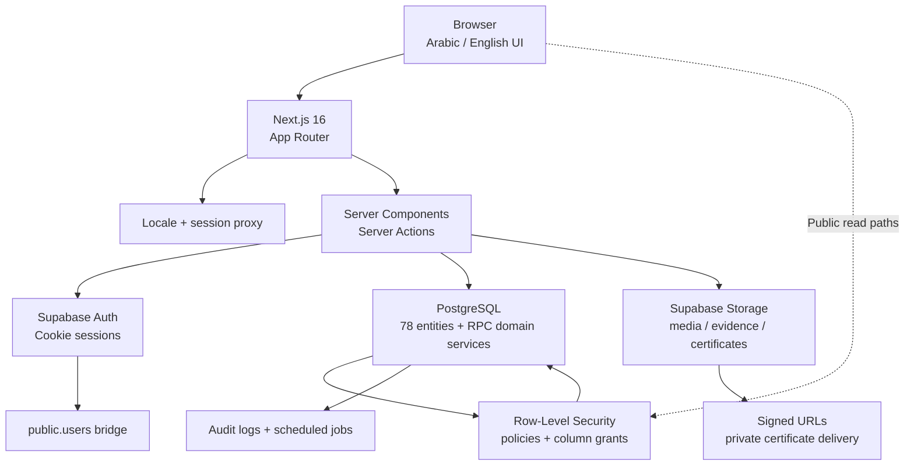
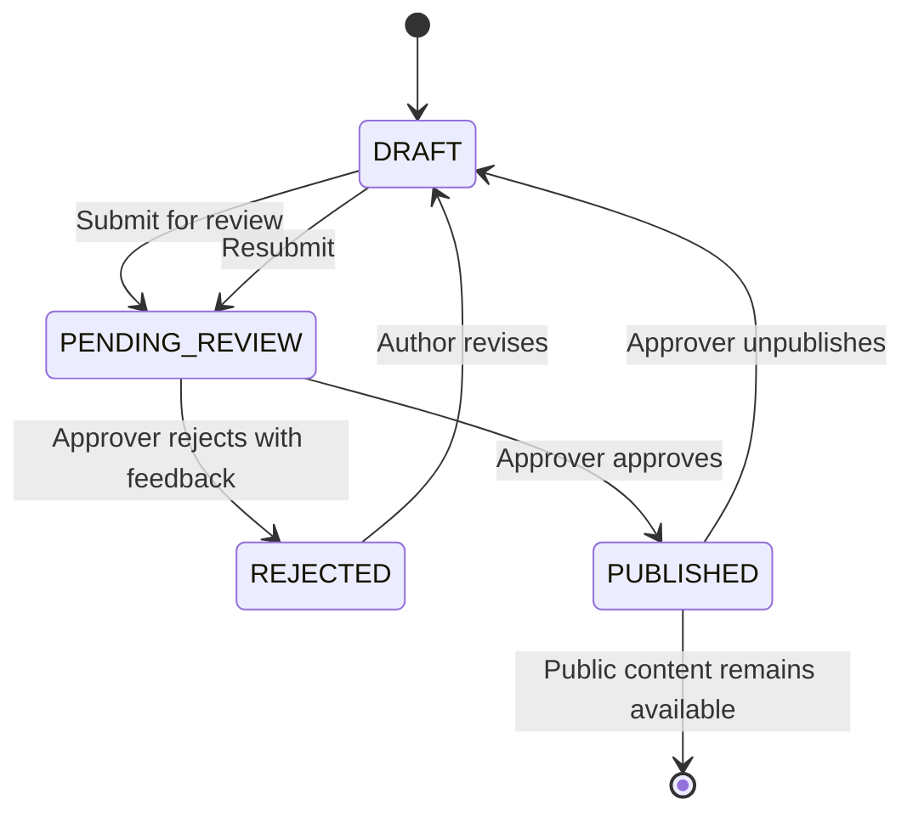

# HMK AI & Robotics Club Platform

<p align="center">
  <strong>A secure, bilingual digital operating platform for the Hamak AI & Robotics Club.</strong><br />
  Admissions, learning, hardware custody, consultations, projects, events, media, and certification in one governed workspace.
</p>

<p align="center">
  <a href="https://nextjs.org/"></a>
  <a href="https://supabase.com/"></a>
  <a href="https://www.typescriptlang.org/"></a>
  <a href="https://tailwindcss.com/"></a>
</p>

## Vision

HMK Platform gives the club a reliable digital foundation for turning public interest into
structured participation. Students can discover courses, request consultations, apply,
learn, borrow equipment, complete clearance, and verify certificates. Authorized teams
manage the underlying operations through least-privilege workflows, auditable transitions,
and database-enforced business rules.

The interface is bilingual by design: Arabic is the default locale with RTL support, while
English is available through locale-aware routing and content fields.

## Features

### Advanced RBAC and governance

- Multi-role, department-scoped, expirable assignments for training, logistics, projects,
  events, media, and administration.
- Permission-aware staff hub and route guards.
- Critical transitions implemented as authorized Supabase RPCs and `SECURITY DEFINER`
  functions, with ownership or permission assertions at the database boundary.
- Append-only auditability for permission-bearing actions.
- Row-level security across all public tables; UI visibility is never treated as the
  security boundary.

### Editorial workflow

- Projects, events, and articles support draft, review, rejection, revision, approval,
  publication, and unpublishing.
- Approval is separate from authoring: editors can prepare content, while approvers control
  publication.
- Publication transitions are database-enforced and server-stamped in accordance with
  BR-11 and D-22.
- Articles use row-per-locale translation groups; incomplete bilingual publication is
  visible to staff.

### Bilingual experience

- `ar` and `en` locale routes powered by `next-intl`.
- Automatic RTL/LTR document direction and logical CSS properties.
- ICU message catalogues with parity and placeholder checks.
- Locale toggle preserves the current route and query string.
- Arabic-friendly typography using the club's Madani font assets.

### Dynamic content and operations

- Public courses, projects, events, articles, galleries, awards, consultations, and
  certificate verification.
- Course applications, screening, readiness scoring, offers, ranked waitlists, attendance,
  and completion.
- Hardware requisitions, stock reservations, serialized custody, returns, incidents, and
  liability resolution.
- Consultation triage, SLA escalation, expertise curation, and expert availability.
- Certificate PDF rendering, SHA-256 content hashing, immutable private storage, and
  short-lived signed delivery URLs.

## Architecture



All server-side data access uses the authenticated Supabase client bound to the request
session. Service-role access is restricted to server-only operational paths such as
scheduled jobs and certificate storage. Business-critical state changes are not trusted
from client-provided status values.

## Editorial workflow



The database authorizes each transition. Hiding a button for a non-approver improves UX,
but cannot replace the publication trigger and permission checks.

## Technology stack

| Area | Technologies |
| --- | --- |
| Frontend | Next.js 16 App Router, React 19.2, TypeScript 5.9, Tailwind CSS v4 |
| UI and state | Radix UI, Lucide, React Hook Form, Zod, Zustand 5, next-themes |
| Internationalization | next-intl v4, Arabic/English ICU catalogues, RTL/LTR routing |
| Backend / BaaS | Supabase Auth, PostgreSQL, Row-Level Security, Storage, scheduled jobs |
| Data access | `@supabase/ssr`, `@supabase/supabase-js`, typed generated database definitions |
| Validation | Zod schemas, PostgreSQL constraints, authorized database domain functions |
| Testing | Vitest, Testing Library, Playwright |
| Delivery | Vercel-compatible Next.js production build; Chromium for certificate rendering |

## Getting started

### Prerequisites

- Node.js `>=20.9.0`
- npm 10+
- A Supabase project
- Supabase CLI for local database work and type generation
- Chromium installed for certificate rendering and Playwright

### 1. Install dependencies

```bash
npm install
npx playwright install chromium
```

### 2. Configure environment variables

Copy the documented template and fill in the values appropriate to your environment:

```bash
copy .env.example .env.local
```

Required public values:

```env
NEXT_PUBLIC_SUPABASE_URL=https://<project-ref>.supabase.co
NEXT_PUBLIC_SUPABASE_ANON_KEY=<publishable-or-anon-key>
NEXT_PUBLIC_SITE_URL=http://localhost:3000
NEXT_PUBLIC_DEFAULT_TZ=Asia/Damascus
```

Server-only and database tooling values are also documented in
[`.env.example`](.env.example). Never expose or commit `SUPABASE_SERVICE_ROLE_KEY` or
`SUPABASE_ACCESS_TOKEN`; neither should use a `NEXT_PUBLIC_` prefix.

Authenticated Playwright scenarios additionally require the role-bearing `E2E_*` values
documented in the template. These accounts must already exist in Supabase and must carry
the corresponding live roles.

### 3. Configure Supabase

For a local Supabase instance:

```bash
supabase start
npm run db:reset
```

For a linked hosted project:

```bash
supabase login
supabase link --project-ref <project-ref>
npm run db:push
npm run db:types
```

The schema, migrations, RLS policies, functions, views, and seed definitions live under
[`supabase/`](supabase/). Do not add or alter entities without recording the corresponding
architecture decision in `claude.md`.

### 4. Run the application

```bash
npm run dev
```

Open `http://localhost:3000/ar` or `http://localhost:3000/en`.

### 5. Verify the project

```bash
npm run typecheck
npm run lint
npm run test
npm run test:e2e:public
npm run i18n:check
```

The complete verification pipeline is:

```bash
npm run verify
```

Database tests require `SUPABASE_ACCESS_TOKEN` and `SUPABASE_PROJECT_REF`. Authenticated
E2E tests use the role credentials from `.env.local`:

```bash
npm run test:e2e:auth
```

## Deployment guide

### Vercel

1. Import the repository into Vercel.
2. Select the production branch (`main`) and use the framework preset **Next.js**.
3. Configure the Node.js version to satisfy `>=20.9.0`.
4. Add the public variables from `.env.example`, using the production Supabase URL and
   the real canonical origin:

   ```env
   NEXT_PUBLIC_SUPABASE_URL=https://<project-ref>.supabase.co
   NEXT_PUBLIC_SUPABASE_ANON_KEY=<production-anon-or-publishable-key>
   NEXT_PUBLIC_SITE_URL=https://club.example.com
   NEXT_PUBLIC_DEFAULT_TZ=Asia/Damascus
   ```

5. Add server-only secrets such as `SUPABASE_SERVICE_ROLE_KEY` only to Vercel server
   environments. Do not expose them to Preview browser bundles.
6. Ensure Chromium is available in the deployment environment if certificate issuance is
   enabled; the renderer returns `RENDERER_UNAVAILABLE` when it is absent.
7. Deploy and verify `/ar`, `/en`, `/robots.txt`, and `/sitemap.xml`.

### Supabase Auth redirect URIs

In **Supabase Dashboard → Authentication → URL Configuration**:

- Set the production **Site URL** to `https://club.example.com`.
- Add the production callback URL:
  `https://club.example.com/auth/callback`
- Add the local callback URL for development:
  `http://localhost:3000/auth/callback`
- Add any approved Vercel Preview callback URLs only if preview authentication is required.

Keep redirect URLs explicit and minimal. Review cookie, email-template, SMTP, and password
policy settings before enabling public registration.

## Project structure

```text
.
├── .env.example
├── claude.md
├── package.json
├── next.config.ts
├── postcss.config.mjs
├── e2e/
│   ├── auth/
│   └── public/
├── journals/
├── scripts/
│   ├── bootstrap-staff-account.mjs
│   ├── cleanup-e2e-data.mjs
│   ├── run-db-tests.mjs
│   └── check-translations.mjs
├── src/
│   ├── app/
│   │   ├── [locale]/
│   │   │   ├── (public)/
│   │   │   ├── (auth)/
│   │   │   ├── staff/
│   │   │   └── layout.tsx
│   │   ├── auth/
│   │   ├── robots.ts
│   │   └── sitemap.ts
│   ├── components/
│   ├── fonts/
│   ├── lib/
│   │   ├── auth/
│   │   ├── authoring/
│   │   └── supabase/
│   ├── messages/
│   │   ├── ar.json
│   │   └── en.json
│   ├── stores/
│   └── styles/
├── supabase/
│   ├── migrations/
│   ├── seed/
│   ├── tests/
│   └── schema.sql
└── tsconfig.json
```

## Security and operating principles

- Supabase RLS is mandatory for every table.
- Server-role credentials stay in server-only modules and deployment secret stores.
- Database functions assert authorization before performing privileged work.
- No client-controlled status transition can bypass the editorial or custody workflow.
- E2E cleanup is dry-run by default and deletes only exact reserved markers.
- Arabic and English user-facing strings ship together; translation parity is checked in CI.

## License and project governance

This platform is maintained for the Hamak AI & Robotics Club. Product rules, schema
decisions, permissions, and operational exceptions are recorded in [`claude.md`](claude.md)
and the session journals. Changes to the frozen data model or load-bearing business rules
require an explicit club-approved decision before implementation.
